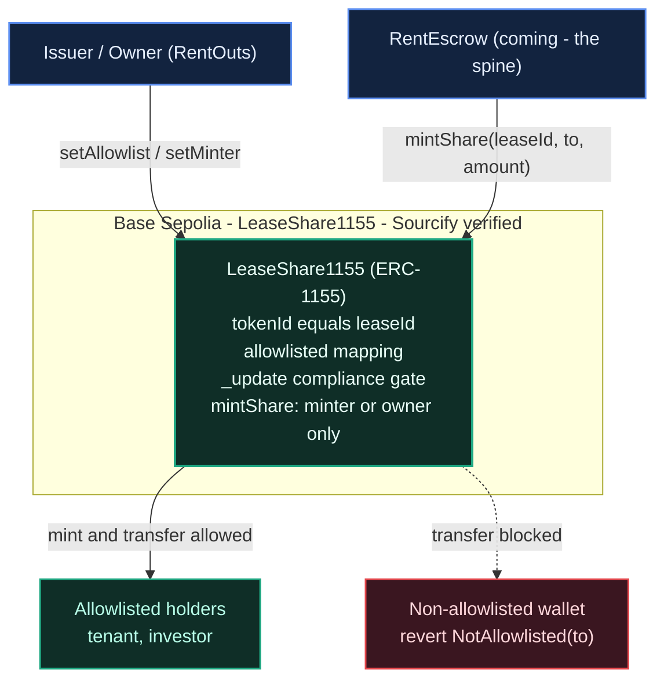
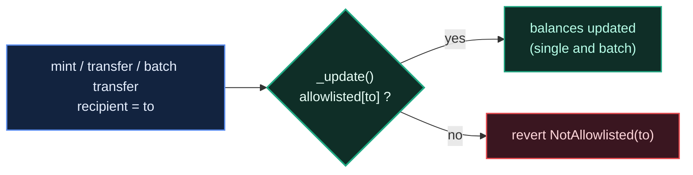

# Architecture — LeaseShare1155 (RWA lease shares)

> On-chain component deployed for the **Curvegrid — Best RWA Tokenization** track at ETHGlobal Tokyo 2026. Live on **Base Sepolia** at [`0x5490e5dFcDcA741aC99127f66B4abf6204cd64C5`](https://sepolia.basescan.org/address/0x5490e5dFcDcA741aC99127f66B4abf6204cd64C5) (Sourcify-verified).

## Overview

RentOuts turns a **rental lease/deposit into a real-world asset (RWA)**: an ERC-1155 token where `tokenId == leaseId`. The defining feature is **compliance-aware transfers** — shares can only be held by allowlisted (KYC / eligibility-approved) wallets, enforced at the token level. It's a minimal, demoable cut of RentOuts' Stage-3 investor surface (permissioned lease shares, Reg D 506(c) / Reg S).

## System diagram



- **Issuer / Owner** (RentOuts) manages the compliance allowlist (`setAllowlist`) and designates the minter (`setMinter`).
- **RentEscrow** (coming) will call `mintShare` when a lease is created — the integration seam is already in place.
- **LeaseShare1155** mints and moves shares, but **every recipient is checked against the allowlist** in the ERC-1155 `_update` hook.
- **Allowlisted holders** (tenant, investor) can receive; **non-allowlisted** wallets are rejected with `NotAllowlisted`.

## The compliance gate

OpenZeppelin v5 routes mint, single transfer, and batch transfer through one hook — `_update`. We override it so the allowlist covers **every** path:



```solidity
function _update(address from, address to, uint256[] memory ids, uint256[] memory values)
    internal
    override
{
    if (to != address(0) && !allowlisted[to]) revert NotAllowlisted(to);
    super._update(from, to, ids, values);
}
```

Because mint, `safeTransferFrom`, and `safeBatchTransferFrom` all funnel through `_update`, there is no path to move a share to a non-approved wallet. Burns (`to == address(0)`) are exempt so a burn entrypoint can be added later.

## Contract surface

| Element | Purpose |
| --- | --- |
| `mapping(uint256 => uint256) totalSupply` | shares minted per lease |
| `mapping(address => bool) allowlisted` | compliance allowlist (who may hold shares) |
| `address minter` | escrow / issuer allowed to mint (owner can always mint) |
| `setAllowlist(account, allowed)` | **owner-only** — add/remove a compliant wallet |
| `setMinter(minter_)` | **owner-only** — designate the escrow as minter |
| `mintShare(leaseId, to, amount)` | **minter/owner** — mint a lease share to an allowlisted holder |
| `_update(...)` | enforces the allowlist on every balance change |

**Roles:** the **owner** (RentOuts) controls the allowlist + minter; the **minter** (the escrow) mints shares; holders can transfer only to other allowlisted holders.

## Deployment (Base Sepolia)

| | |
| --- | --- |
| Contract | [`0x5490…64C5`](https://sepolia.basescan.org/address/0x5490e5dFcDcA741aC99127f66B4abf6204cd64C5) |
| Verified | Sourcify (exact match) |
| Deploy tx | [`0x76164bf8…`](https://sepolia.basescan.org/tx/0x76164bf89428462ed9b8220f609cefa101efce9d4a8d677d16a27083c332400c) |

On-chain compliance demo (real transactions): mint 1000 → allowlisted transfer of 400 **succeeds** → non-allowlisted transfer **reverts** `NotAllowlisted`. Tx links are in the [README](./README.md) and `deployments.json`.

## How it fits RentOuts

- **Non-custodial:** the token encodes ownership + transfer rules; RentOuts never holds user funds (ADR-0013 posture).
- **Integration seam:** `RentEscrow` (the coming spine) is set as `minter` and calls `mintShare(leaseId, …)` when a lease is created — no change needed here.
- **Roadmap:** this is the demoable core of the Stage-3 investor surface (`InvestorPool` ERC-1155 + `TransferAgent` permissioned transfers).

## Testing

**12 Foundry tests** (incl. a 256-run fuzz + batch-transfer coverage) prove: mint gating, allowlist enforcement on single **and** batch transfers, revoke-mid-life, and access control. Run `forge test -vv`.

## Diagram sources

Editable Mermaid sources: [`docs/diagrams/architecture.mmd`](./docs/diagrams/architecture.mmd), [`docs/diagrams/compliance-gate.mmd`](./docs/diagrams/compliance-gate.mmd). Render to SVG with `mmdc -i <file>.mmd -o <file>.svg`.
