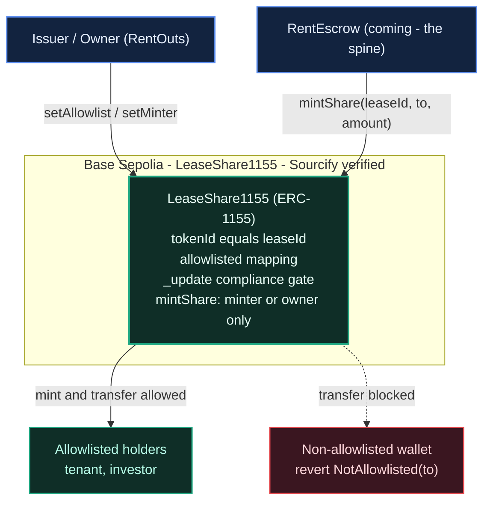

# RentOuts — On-Chain Rental Escrow (ETHGlobal Tokyo 2026)

> **Trust-minimized rental escrow** — part of [RentOuts](https://rentouts.co), a blockchain-powered rental marketplace. Deposits and rent are held in USDC by a smart contract (not a landlord), and released/refunded on agreed conditions. Built live at **ETHGlobal Tokyo 2026** (Sep 25–27).

**Status:** 🟢 Building during the event. Existing product (the RentOuts marketplace is live); the on-chain escrow + sponsor integrations here are the new hackathon work (Continuity Track).

## What's in this repo

| Path | What |
| --- | --- |
| `src/LeaseShare1155.sol` | **RWA lease-share token** — ERC-1155 tokenizing a lease/deposit with compliance-aware (allowlist) transfers |
| `test/LeaseShare1155.t.sol` | Foundry tests incl. a fuzz proving non-allowlisted recipients are always rejected |
| `script/DeployLeaseShare.s.sol` | Base Sepolia deploy script |
| `src/RentEscrow.sol` | **Rental escrow** — holds the tenant's USDC deposit + prepaid rent, releases rent per period, returns the deposit; arbiter-split disputes |
| `src/interfaces/IRentEscrow.sol` | Pinned escrow interface (lifecycle, events, errors, invariants) shared with the app and the ENS credential sync |
| `src/HumanGate.sol`, `src/interfaces/IHumanGate.sol` | **Human gate** — the seam where World ID plugs in later: decides who may fund a new lease, never touches funds |
| `test/RentEscrow.t.sol`, `test/RentEscrow.invariant.t.sol`, `test/RentEscrow.blacklist.t.sol` | 53 unit/fuzz tests (4 of them with a USDC-style blacklisting token) + a handler-based invariant suite (INV-1..INV-4) |
| `test/HumanGate.t.sol` | 16 tests of the human gate: off, open, refusing, verifier swapped later on the same escrow, owner-only |
| `script/DeployEscrow.s.sol` | Ethereum Sepolia deploy of RentEscrow + LeaseShare1155 + HumanGate (keystore signing) → `"sepolia"` entry of `deployments.json` |
| `test/DeployEscrow.t.sol` | 15 tests of the deploy script's config checks, wiring and deployment record |
| `src/AIArbiter.sol` | **AI dispute arbiter**: RentEscrow's arbiter contract. An AI judge proposes a split, either party can appeal within a challenge window, and a human arbiter has the last word |
| `test/AIArbiter.t.sol`, `test/AIArbiter.invariant.t.sol` | 34 unit/fuzz tests against the real RentEscrow + an invariant suite (AI-1..AI-3) |
| `script/DeployAIArbiter.s.sol`, `test/DeployAIArbiter.t.sol` | Sepolia deploy (keystore signing) → `"sepoliaAIArbiter"` entry of `deployments.json`, and 5 tests |
| [`judge/`](./judge/README.md) | **AI judge service** (TypeScript): reads a disputed lease and both parties' statements, asks GLM 5.3 a fixed checklist, computes the split in code, proposes it to AIArbiter |
| `deployments.json` | Live contract addresses |
| [`ARCHITECTURE.md`](./ARCHITECTURE.md) | Design + diagrams for the deployed contract |

_ENS identity (`RentoutsSubnames` on ENSv2, Ethereum Sepolia) lives on the `ens-integration` branch under `ens/`._

---

## 🔐 RentEscrow — non-custodial USDC rental escrow (Ethereum Sepolia)

**One-sentence summary:** a smart contract — not RentOuts, not the landlord — holds the tenant's deposit and prepaid rent in USDC, pays the landlord one period at a time, returns the deposit at the end, and lets a fixed arbiter, which can never be a lease's landlord or tenant, do exactly one thing: split a disputed lease's own escrow between its tenant and landlord.

`src/RentEscrow.sol` implements [`src/interfaces/IRentEscrow.sol`](./src/interfaces/IRentEscrow.sol). Constructor `(token, arbiter, leaseShare, humanGate)`, all immutable. No owner, no admin, no fees, no upgradeability. OpenZeppelin v5.1 `SafeERC20` + `ReentrancyGuard`, checks-effects-interactions throughout.

### Lifecycle

| Call | Who | Effect |
| --- | --- | --- |
| `createLease(tenant, deposit, rentPerPeriod, periodSeconds, periods)` | landlord (never the arbiter) | → `CREATED`, ids start at 1; reverts `InvalidTerms` if the arbiter is the landlord or the tenant. Mints **100 `LeaseShare1155` shares** (`tokenId == leaseId`) to the landlord, so a landlord outside the compliance allowlist **cannot list** (the call reverts) |
| `cancelLease(id)` | landlord | `CREATED` → `CANCELLED` (no funds involved) |
| `fundLease(id)` | tenant (a verified human, if a human gate is set) | pulls `deposit + rentPerPeriod × periods` (after a USDC `approve`); `CREATED` → `ACTIVE`, the clock starts. Reverts `NotVerifiedHuman(tenant)` if the gate says no |
| `claimRent(id)` | anyone | releases every elapsed, unclaimed period to the landlord (only ever to the landlord) |
| `closeLease(id)` | landlord from `endTime`; anyone from `endTime + periodSeconds` | rest of the rent → landlord, deposit → tenant; `ACTIVE` → `CLOSED`. The one-period grace gives the landlord time to dispute the deposit |
| `openDispute(id)` | tenant or landlord | `ACTIVE` → `DISPUTED`; rent is frozen. Allowed until someone closes the lease, also after the grace window; moves no tokens |
| `resolveDispute(id, tenantBps)` | arbiter | remaining escrow: `tenantBps / 10000` → tenant (rounded down), the rest → landlord; → `CLOSED` |

Periods can be as short as `MIN_PERIOD = 60` seconds, so a whole lease plays out live in a demo. `claimable(id)` and `endTime(id)` drive the UI; `tenantStats(tenant)` (leases funded / completed / disputed, periods and rent paid, deposits posted / returned) is the on-chain track record that RentOuts syncs into the tenant's `rentouts.*` ENS records.

**Deposit accounting in a dispute.** The arbiter splits one pot (deposit + rent not yet released), so `depositsReturned` reads the tenant's payout in a fixed order: first a refund of rent not yet earned when the dispute was opened, then the deposit, then earned rent. Only the middle part counts as deposit returned (capped at the deposit). A ruling that gives the tenant back its unused rent but lets the landlord keep the deposit records 0 returned; one that returns the deposit and leaves earned rent to the landlord records the full deposit, whether or not that rent had been claimed. `rentPaid` / `periodsPaid` read the landlord's payout from the other end: earned-but-unclaimed rent comes first, and whatever of it the landlord receives counts as rent paid (whole periods as periods paid), as if it had been claimed before the dispute. Rent stops accruing when the dispute opens, so a slow ruling changes nothing.

### Human gate: where World ID plugs in

The escrow has no owner and cannot change, yet World ID has to be added later. The escrow takes a `humanGate` address once, at deployment (`address(0)` = no gating, ever), and `fundLease` asks it `isVerified(tenant)`. By default the deploy script creates a `HumanGate` owned by the deployer that forwards the question to a `verifier`:

- `verifier == address(0)` (as deployed): the gate is **open**, and every tenant can fund. This is the state today, since World ID is not built yet.
- `HumanGate.setVerifier(worldAdapter)` (owner only, emits `VerifierUpdated`): from then on only addresses the verifier approves can fund **new** leases. Same escrow address, no redeploy. Setting it back to `address(0)` reopens the gate.

The gate owner can only decide **who may fund a new lease**. It holds no tokens and cannot move, freeze or redirect funds. `claimRent`, `closeLease`, `openDispute` and `resolveDispute` never consult it, so a funded lease runs to the end whatever the gate says (tested). If the verifier reverts, funding fails closed until the owner fixes or clears it.

### Invariants (`test/RentEscrow.invariant.t.sol`)

A handler runs random create / fund / warp / claim / close / dispute / resolve / cancel sequences across four actors (funding through a `HumanGate` with a verifier that approves them), a keeper and the arbiter, and books every token transfer out of the escrow from the token's own `Transfer` logs:

- **INV-1** funds only ever move to the lease's tenant or landlord — every actor's balance equals minted − escrowed + received, and the arbiter / keeper / share issuer never hold a token.
- **INV-2** `Σ escrowBalance(leaseId) == usdc.balanceOf(escrow)`, and each lease's balance matches its state.
- **INV-3** rent released for a lease never exceeds `rentPerPeriod × elapsed periods` (capped at the term).
- **INV-4** a dispute resolution pays out exactly the lease's remaining escrow, split by `tenantBps`.

64 runs × 256 calls, `fail_on_revert = true` (the handler only makes valid calls, so any revert is a bug). At depth 64 up to half the runs never reached `closeLease` (and 13–25 of 64 never reached `resolveDispute` or `claimRent`); at 256 every measured run reached all three, and an `afterInvariant` guard fails any run that settles no lease. As a sanity check, each of these injected bugs breaks the suite: dropping the term cap, paying the arbiter, leaving a closed lease's balance, rounding the split up.

### Test

```bash
forge test --match-path 'test/RentEscrow*' -vv   # 53 unit/fuzz tests + 4 invariants, ~15 s
forge test --match-path test/HumanGate.t.sol      # 16 human-gate tests
forge test --match-path test/DeployEscrow.t.sol   # 15 deploy-script tests
forge test --match-path 'test/AIArbiter*'         # 34 AIArbiter tests + 3 invariants (AI-1..AI-3)
forge test                                        # everything, incl. the 12 LeaseShare1155 tests (134 total)
```

Unit tests cover every function and exact custom-error revert, partial / complete claims with `vm.warp`, the close grace rule, cancel, 0 / 5000 / 10000 bps splits (plus a fuzzed split), share minting and the non-allowlisted-landlord revert, re-entry through the ERC-1155 receive hook, the arbiter never being a party, tenant-stats accounting (including how a dispute payout splits into refunded rent, returned deposit and rent paid), and the way out when USDC blacklists the landlord or the tenant.

### Deploy (Ethereum Sepolia)

```bash
cast wallet import rentouts-deployer --interactive   # once: encrypted Foundry keystore, no PRIVATE_KEY in env
export SEPOLIA_RPC_URL=https://ethereum-sepolia-rpc.publicnode.com
export ESCROW_ARBITER=0x...                          # required: an EOA or a contract (e.g. a Safe); never the deployer or a demo landlord/tenant
# optional: ESCROW_HUMAN_GATE (unset = deploy a new open HumanGate owned by the deployer;
#                              "none" = no gating, ever, on this escrow; or an existing IHumanGate address),
#           ESCROW_TOKEN (default: Circle test USDC 0x1c7D4B196Cb0C7B01d743Fbc6116a902379C7238),
#           LEASE_SHARE (an unused LeaseShare1155 the deployer owns; default: deploy a new one)

# dry run: simulation only, records nothing
forge script script/DeployEscrow.s.sol --rpc-url sepolia --sender <deployer>

# deploy + record the "sepolia" entry of deployments.json (add --verify with ETHERSCAN_API_KEY set)
forge script script/DeployEscrow.s.sol --rpc-url sepolia \
  --account rentouts-deployer --sender <deployer> --broadcast
```

The arbiter is fixed in the escrow forever, so choose it before deploying. It can be an EOA or a contract (a Safe, or an arbiter contract deployed beforehand); the escrow only checks `msg.sender == arbiter`.

The script records `chainId`, `deployer`, `token`, `arbiter`, `humanGate`, `rentEscrow` and `leaseShare1155` under the `"sepolia"` key of the root `deployments.json`, as a read-modify-write of that one key, so the `"baseSepolia"` entry (the standalone `LeaseShare1155` on Base Sepolia) stays as it is. It writes only when forge is really broadcasting (`--broadcast` or `--resume`, checked with `vm.isContext`), never in a dry run or a test; a `BROADCAST` env var is not needed and does nothing on its own. forge writes the record while running the script, before the transactions are sent, so the deploy transaction hashes are not in it: they are in `broadcast/DeployEscrow.s.sol/11155111/run-latest.json`. If a broadcast fails part-way, check the addresses there before using them.

The script makes the escrow the `LeaseShare1155` minter and allowlists the deployer as the demo landlord, so it refuses an `ESCROW_ARBITER` equal to the deployer (an arbiter that is also a party could open a dispute and rule the whole escrow to itself; `RentEscrow` rejects such leases anyway). It is **one `LeaseShare1155` per `RentEscrow`**: lease ids restart at 1 in every escrow and `tokenId == leaseId`, so the script refuses a `LEASE_SHARE` that is already wired to an escrow (or already holds shares of tokenId 1). To redeploy the escrow, let it deploy a new share contract. Every other landlord has to be allowlisted by the share owner before they can list: `cast send <leaseShare1155> "setAllowlist(address,bool)" <landlord> true --account rentouts-deployer --rpc-url sepolia`. With the new `HumanGate`, the deploy estimates at ~4.4M gas on a local node (about 0.0044 ETH at 1 gwei), which the ETHGlobal faucet's 0.05 Sepolia ETH covers.

Plugging World ID in later is one call from the gate owner, with no escrow redeploy: `cast send <humanGate> "setVerifier(address)" <worldVerifier> --account rentouts-deployer --rpc-url sepolia`.

**Demo amounts:** the ETHGlobal faucet hands out 1 USDC on Sepolia per claim, so keep demo leases small. For example, `createLease(tenant, 300000, 100000, 60, 3)` escrows a 0.30 USDC deposit + 3 × 0.10 USDC rent at 60-second periods (0.60 USDC total).

- **Deployed addresses (Ethereum Sepolia):** _TBD — written to the `"sepolia"` entry of `deployments.json` by the deploy script_

### Honest limits

- Testnet only: Ethereum Sepolia with **Circle's test USDC**. Hackathon code, not audited.
- The arbiter is a **single EOA** for the hackathon, or `AIArbiter` with a single human EOA behind it (a Safe multisig in production; the contract accepts either). It can never be a lease's landlord or tenant and never send funds outside the lease's two parties, but it decides the split, and a disputed lease stays frozen until it rules: there is no timeout or fallback. Either party can open a dispute for as long as the lease is `ACTIVE`, even after the grace window, so a tenant can pre-empt a keeper's `closeLease`; the grace window only guarantees the landlord a turn.
- World ID is **not wired in yet**: the deployed `HumanGate` is open (verifier `0`) until a verifier is set. Its owner is the deployer EOA, who can then refuse funding of new leases (never touch existing ones).
- Earned rent that nobody has claimed when a dispute opens (by either party) is part of the arbiter's pot: it is frozen until the ruling, and a ruling can move part of it to the tenant (for example an arbiter that rules in coarse steps, such as an AI judge's 25% steps). `claimRent` is open to anyone, so a landlord or keeper should claim as periods elapse. `tenantStats` counts only the rent that actually reaches the landlord.
- `tenantStats` are counts, not weighted by value or term: a landlord and a tenant working together can build a record out of 1-unit, 60-second leases for the cost of gas. The sybil brake is landlord allowlisting on `LeaseShare1155` (only allowlisted landlords can create leases; today only the deployer), so an escrow deployed without lease shares has no brake. A minimum lease term would add real cost; weighting by value would not, since the deposit comes back a minute later.
- Lease shares minted at `createLease` stay with the landlord if the lease is cancelled (`LeaseShare1155` has no burn).
- Payouts are pushed, and USDC can blacklist addresses. If the landlord or the tenant is blacklisted, every call that pays them reverts, including the other party's `closeLease` and any split ruling. The other party can still `openDispute` (it moves no tokens), but only a 0 or 10000 bps ruling then pays out, which hands the blocked party's share to the other one (tested with a blacklisting mock). Pull payments (credit a failed transfer, add `withdraw`) would keep the agreed split; not done for the hackathon.
- The token must be a plain ERC-20 (no fee-on-transfer or rebasing), which USDC is. With shares enabled, a contract landlord must implement `onERC1155Received`.

---

## ⚖️ AI dispute judge: AIArbiter + `judge/` (Ethereum Sepolia)

**One-sentence summary:** when a lease is disputed, an AI judge reads both parties' statements and proposes a split within seconds. A challenge window lets either party appeal to a human arbiter, and the human can rule or override at any time. The AI never moves money on its own.

`src/AIArbiter.sol` is meant to be RentEscrow's (immutable) arbiter. It has two roles:

- **agent**: the judge service key. It can only `propose(leaseId, tenantBps, rulingHash, confidenceBps, summary)` on a `DISPUTED` lease.
- **human**: the human arbiter EOA, a Safe in production. It can `resolveByHuman(leaseId, tenantBps)` at any time, directly or overriding a proposal, and it sets the agent and the window. It hands its own role over in two steps, `setHuman(new)` then `acceptHuman()` from the new address, so a mistyped address cannot strand appealed leases (only the human can close those).

| Call | Who | Effect |
| --- | --- | --- |
| `submitEvidence(id, statement)` | tenant or landlord, while `DISPUTED` | `Evidence` event; 1–1000 bytes, at most 5 per party |
| `propose(id, tenantBps, rulingHash, confidenceBps, summary)` | agent | one proposal per lease; replaceable only while its window runs (the window restarts), never after an appeal |
| `appeal(id)` | tenant or landlord, inside the window | → only the human can rule |
| `execute(id)` | anyone, from the deadline, if not appealed | `escrow.resolveDispute(id, tenantBps)` |
| `resolveByHuman(id, tenantBps)` | human, any time while `DISPUTED` | `escrow.resolveDispute(id, tenantBps)` |
| `bindEscrow(escrow)` | human, once | only an escrow whose arbiter is this contract |
| `setHuman(new)` → `acceptHuman()` | human, then the nominee | the old human keeps the role until the nominee accepts; `setHuman(0)` cancels |

**Invariant AI-1:** the only state-changing call AIArbiter can make is `escrow.resolveDispute` on the bound escrow. Its other calls are views on that same escrow. The invariant suite state-diff records every call it makes. So a bad AI ruling, or even a stolen agent or human key, can at worst split one disputed lease's escrow wrongly between its own two parties (RentEscrow INV-1 / INV-4). It can never steal. The suite also checks **AI-2**: no token ever reaches the arbiter, the agent, the human or a stranger. It checks **AI-3**: every closed lease was either executed after an unappealed window or ruled by the human, and paid exactly that split. Neither the agent nor the human can rule from an address that is a party to the lease (`PartyCannotArbitrate`). For the agent that is a hard limit. The human is a trusted role, so for it the check only prevents ruling by accident: it could hand the role to another key it controls and rule on its own lease, and a lease where the human is a party can only be closed that way. Keep the human arbiter's address out of every lease (the demo EOA `0x798b…e486` is neither the demo landlord nor alice), and use a Safe in production.

**Deploy order** (RentEscrow's arbiter is immutable):

```bash
AI_AGENT=<judge address> forge script script/DeployAIArbiter.s.sol --rpc-url sepolia \
  --account rentouts-deployer --sender <deployer> --broadcast        # AI_HUMAN defaults to 0x798b…e486, AI_CHALLENGE_WINDOW to 120 s
ESCROW_ARBITER=<aiArbiter> forge script script/DeployEscrow.s.sol --rpc-url sepolia \
  --account rentouts-deployer --sender <deployer> --broadcast
cast send <aiArbiter> "bindEscrow(address)" <rentEscrow> --account <human keystore> --rpc-url sepolia
```

`DeployAIArbiter` records `chainId`, `deployer`, `human`, `agent`, `challengeWindow`, `fromBlock` and `aiArbiter` under a top-level `"sepoliaAIArbiter"` key of `deployments.json`, and only in a real broadcast. The key is separate because `DeployEscrow` runs afterwards and rewrites the whole `"sepolia"` entry.

**The judge** ([`judge/README.md`](./judge/README.md)): `npm run judge -- --lease <id> [--provider glm|mock] [--propose]`. The model (z.ai GLM 5.3; a deterministic mock without a key) answers three narrow yes/no questions, each with a probability: damage beyond normal wear, whether the landlord's claim to the remaining rent is valid, and whether the evidence is sufficient. It also gives a severity from 1 to 5 and a short rationale. **Code** turns the answers into `tenantBps` with a documented rubric, rounded to 0 / 25 / 50 / 75 / 100 %. The judge abstains, escalating to the human, when the evidence is insufficient or any answer's confidence is below 0.7. `rulingHash` is the keccak256 of the canonical JSON ruling, and anyone can recompute it. Statements reach the model as quoted, source-labelled data, and the system prompt treats them as possibly false or manipulative. Limits are in the judge README: an uncalibrated model, text-only evidence, coarse splits, and a human route with no deadline.

---

## 🏦 Curvegrid — Best RWA Tokenization Project

**One-sentence summary:** RentOuts tokenizes a rental lease/deposit as an ERC-1155 real-world asset whose shares can only move between compliance-approved (allowlisted) wallets — the on-chain building block for fractional, transfer-restricted rental ownership.

- **What it does:** `LeaseShare1155` mints a share per lease (`tokenId == leaseId`). Every transfer — single **and batch** — runs through an allowlist check in the OZ v5 `_update` hook, so shares can only be received by KYC/eligibility-approved addresses — "compliance-aware transfer logic" for real-estate RWAs. Revoking an address blocks further transfers to it immediately.
- **How this maps to the product:** it's a minimal cut of RentOuts' Stage-3 investor surface (permissioned ERC-1155 lease shares + transfer agent, Reg D 506(c)/Reg S).
- **MultiBaas:** _(optional — TBD)_ we may register the deployed contract in MultiBaas and read balances via its REST API for the demo dashboard.
- **MultiBaas feedback:** _TBD_

### 🟢 Live on Base Sepolia

| | |
| --- | --- |
| Contract | [`0x5490e5dFcDcA741aC99127f66B4abf6204cd64C5`](https://sepolia.basescan.org/address/0x5490e5dFcDcA741aC99127f66B4abf6204cd64C5) |
| Network | Base Sepolia (chainId 84532) |
| Source | verified via Sourcify |
| Deploy tx | [`0x76164bf8…332400c`](https://sepolia.basescan.org/tx/0x76164bf89428462ed9b8220f609cefa101efce9d4a8d677d16a27083c332400c) |

**On-chain compliance demo (real transactions):**
- Mint 1000 shares of lease #1 — [`0x87be65…b95a29`](https://sepolia.basescan.org/tx/0x87be65e59b2bff356269d8e2cfe5c4a0d5b51f9ca793ad138e64c40342b95a29)
- Allowlist recipient `0x…bEEF` — [`0xbb1396…f8c07a4`](https://sepolia.basescan.org/tx/0xbb1396555cf4d02c14e4eeed1209c448eae1a76de3955fa86d5f87ec2f8c07a4)
- **Allowlisted** transfer of 400 succeeds — [`0x34227e…442dddce`](https://sepolia.basescan.org/tx/0x34227e62ef9b0002589e5827114932960eed8ea54089ccae38bd41ae442dddce)
- **Non-allowlisted** transfer reverts `NotAllowlisted` (compliance gate holds)

Resulting balances: issuer 600, allowlisted recipient 400, totalSupply 1000.

### Team
- [@AiAlchemist0](https://github.com/AiAlchemist0) (Dean) — contracts / RWA
- Bektur — ENS identity

---

## Architecture

Full write-up + diagrams: **[ARCHITECTURE.md](./ARCHITECTURE.md)**. `LeaseShare1155` tokenizes a lease/deposit as a permissioned ERC-1155 (`tokenId == leaseId`); every recipient is checked against a compliance allowlist in the OZ v5 `_update` hook, so shares can only move between approved wallets.



---

## Setup & testing

Requires [Foundry](https://getfoundry.sh).

```bash
# 1. Install dependencies (OpenZeppelin v5)
forge install OpenZeppelin/openzeppelin-contracts@v5.1.0 --no-commit

# 2. Build + test
forge build
forge test -vv
```

Expected: **12 passing** `LeaseShare1155` tests — mint/transfer/batch allowlist gating, revoke-mid-life, access control, and `testFuzz_TransferToRandom_RejectedUnlessAllowlisted` (256 runs) proving the compliance gate.

### Deploy to Base Sepolia

```bash
cp .env.example .env   # fill in PRIVATE_KEY (a fresh testnet EOA), RPC, Basescan key
source .env
forge script script/DeployLeaseShare.s.sol --rpc-url base_sepolia --broadcast --verify
```

## Links
- Product: https://rentouts.co
- Demo video: _coming soon (ETHGlobal submission)_

## License
[MIT](./LICENSE)
