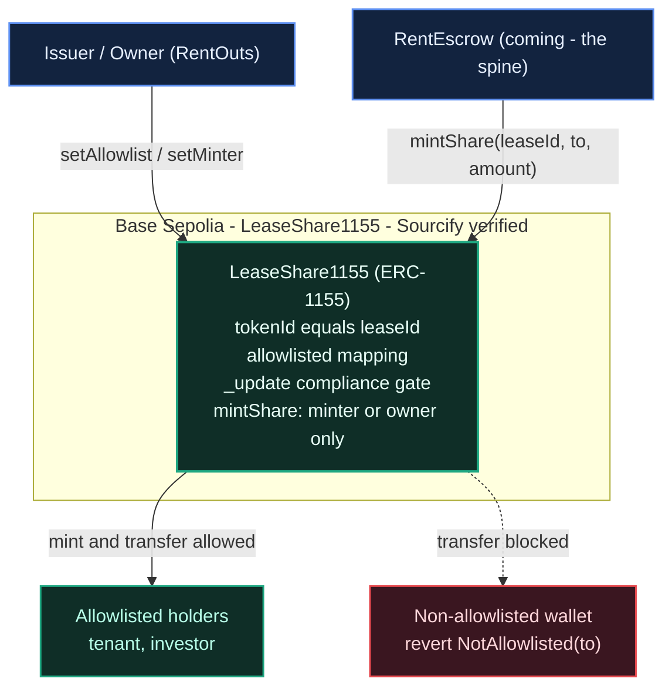

# RentOuts — On-Chain Rental Escrow (ETHGlobal Tokyo 2026)

> **Trust-minimized rental escrow** — part of [RentOuts](https://rentouts.co), a blockchain-powered rental marketplace. Deposits and rent are held in USDC by a smart contract (not a landlord), and released/refunded on agreed conditions. Built live at **ETHGlobal Tokyo 2026** (Sep 25–27).

**Status:** 🟢 Building during the event. Existing product (the RentOuts marketplace is live); the on-chain escrow + sponsor integrations here are the new hackathon work (Continuity Track).

## What's in this repo

| Path | What |
| --- | --- |
| `src/LeaseShare1155.sol` | **RWA lease-share token** — ERC-1155 tokenizing a lease/deposit with compliance-aware (allowlist) transfers |
| `test/LeaseShare1155.t.sol` | Foundry tests incl. a fuzz proving non-allowlisted recipients are always rejected |
| `script/DeployLeaseShare.s.sol` | Base Sepolia deploy script |
| `src/RentEscrow.sol` | **Rental escrow** — holds the tenant's USDC deposit + prepaid rent, releases rent per period, returns the deposit; arbiter-split disputes |
| `src/interfaces/IRentEscrow.sol` | Pinned escrow interface (lifecycle, events, errors, invariants) shared with the app and the ENS credential sync |
| `test/RentEscrow.t.sol`, `test/RentEscrow.invariant.t.sol` | 43 unit/fuzz tests + a handler-based invariant suite (INV-1..INV-4) |
| `script/DeployEscrow.s.sol` | Ethereum Sepolia deploy of RentEscrow + LeaseShare1155 (keystore signing) → `deployments/sepolia.json` |
| `test/DeployEscrow.t.sol` | 4 tests of the deploy script's config checks and wiring |
| `deployments.json` | Live contract addresses |
| [`ARCHITECTURE.md`](./ARCHITECTURE.md) | Design + diagrams for the deployed contract |

_ENS identity (`RentoutsSubnames` on ENSv2, Ethereum Sepolia) lives on the `ens-integration` branch under `ens/`._

---

## 🔐 RentEscrow — non-custodial USDC rental escrow (Ethereum Sepolia)

**One-sentence summary:** a smart contract — not RentOuts, not the landlord — holds the tenant's deposit and prepaid rent in USDC, pays the landlord one period at a time, returns the deposit at the end, and lets a fixed arbiter, which can never be a lease's landlord or tenant, do exactly one thing: split a disputed lease's own escrow between its tenant and landlord.

`src/RentEscrow.sol` implements [`src/interfaces/IRentEscrow.sol`](./src/interfaces/IRentEscrow.sol). Constructor `(token, arbiter, leaseShare)`, all immutable. No owner, no admin, no fees, no upgradeability. OpenZeppelin v5.1 `SafeERC20` + `ReentrancyGuard`, checks-effects-interactions throughout.

### Lifecycle

| Call | Who | Effect |
| --- | --- | --- |
| `createLease(tenant, deposit, rentPerPeriod, periodSeconds, periods)` | landlord (never the arbiter) | → `CREATED`, ids start at 1; reverts `InvalidTerms` if the arbiter is the landlord or the tenant. Mints **100 `LeaseShare1155` shares** (`tokenId == leaseId`) to the landlord, so a landlord outside the compliance allowlist **cannot list** (the call reverts) |
| `cancelLease(id)` | landlord | `CREATED` → `CANCELLED` (no funds involved) |
| `fundLease(id)` | tenant | pulls `deposit + rentPerPeriod × periods` (after a USDC `approve`); `CREATED` → `ACTIVE`, the clock starts |
| `claimRent(id)` | anyone | releases every elapsed, unclaimed period to the landlord (only ever to the landlord) |
| `closeLease(id)` | landlord from `endTime`; anyone from `endTime + periodSeconds` | rest of the rent → landlord, deposit → tenant; `ACTIVE` → `CLOSED`. The one-period grace gives the landlord time to dispute the deposit |
| `openDispute(id)` | tenant or landlord | `ACTIVE` → `DISPUTED`; rent is frozen |
| `resolveDispute(id, tenantBps)` | arbiter | remaining escrow: `tenantBps / 10000` → tenant (rounded down), the rest → landlord; → `CLOSED` |

Periods can be as short as `MIN_PERIOD = 60` seconds, so a whole lease plays out live in a demo. `claimable(id)` and `endTime(id)` drive the UI; `tenantStats(tenant)` (leases funded / completed / disputed, periods and rent paid, deposits posted / returned) is the on-chain track record that RentOuts syncs into the tenant's `rentouts.*` ENS records.

### Invariants (`test/RentEscrow.invariant.t.sol`)

A handler runs random create / fund / warp / claim / close / dispute / resolve / cancel sequences across four actors, a keeper and the arbiter, and books every token transfer out of the escrow from the token's own `Transfer` logs:

- **INV-1** funds only ever move to the lease's tenant or landlord — every actor's balance equals minted − escrowed + received, and the arbiter / keeper / share issuer never hold a token.
- **INV-2** `Σ escrowBalance(leaseId) == usdc.balanceOf(escrow)`, and each lease's balance matches its state.
- **INV-3** rent released for a lease never exceeds `rentPerPeriod × elapsed periods` (capped at the term).
- **INV-4** a dispute resolution pays out exactly the lease's remaining escrow, split by `tenantBps`.

64 runs × 64 calls, `fail_on_revert = true` (the handler only makes valid calls, so any revert is a bug). As a sanity check, each of these injected bugs breaks the suite: dropping the term cap, paying the arbiter, leaving a closed lease's balance, rounding the split up.

### Test

```bash
forge test --match-path 'test/RentEscrow*' -vv   # 43 unit/fuzz tests + 4 invariants, ~2 s
forge test --match-path test/DeployEscrow.t.sol   # 4 deploy-script tests
```

Unit tests cover every function and exact custom-error revert, partial / complete claims with `vm.warp`, the close grace rule, cancel, 0 / 5000 / 10000 bps splits (plus a fuzzed split), share minting and the non-allowlisted-landlord revert, re-entry through the ERC-1155 receive hook, and tenant-stats accounting.

### Deploy (Ethereum Sepolia)

```bash
cast wallet import rentouts-deployer --interactive   # once: encrypted Foundry keystore, no PRIVATE_KEY in env
export SEPOLIA_RPC_URL=https://ethereum-sepolia-rpc.publicnode.com
export ESCROW_ARBITER=0x...                          # required: a separate EOA, never the deployer or a demo landlord/tenant
# optional: ESCROW_TOKEN (default: Circle test USDC 0x1c7D4B196Cb0C7B01d743Fbc6116a902379C7238),
#           LEASE_SHARE (an existing LeaseShare1155 the deployer owns; default: deploy a new one)

# dry run: simulation only, records nothing
forge script script/DeployEscrow.s.sol --rpc-url sepolia --sender <deployer>

# deploy + write deployments/sepolia.json (add --verify with ETHERSCAN_API_KEY set)
BROADCAST=true forge script script/DeployEscrow.s.sol --rpc-url sepolia \
  --account rentouts-deployer --sender <deployer> --broadcast
```

The script makes the escrow the `LeaseShare1155` minter and allowlists the deployer as the demo landlord, so it refuses an `ESCROW_ARBITER` equal to the deployer (an arbiter that is also a party could open a dispute and rule the whole escrow to itself; `RentEscrow` rejects such leases anyway). Every other landlord has to be allowlisted by the share owner before they can list: `cast send <leaseShare1155> "setAllowlist(address,bool)" <landlord> true --account rentouts-deployer --rpc-url sepolia`. The dry run simulates at ~3.9M gas (≈0.0085 ETH at ~1 gwei), which the ETHGlobal faucet's 0.05 Sepolia ETH covers.

**Demo amounts:** the ETHGlobal faucet hands out 1 USDC on Sepolia per claim, so keep demo leases small. For example, `createLease(tenant, 300000, 100000, 60, 3)` escrows a 0.30 USDC deposit + 3 × 0.10 USDC rent at 60-second periods (0.60 USDC total).

- **Deployed addresses (Ethereum Sepolia):** _TBD — written to `deployments/sepolia.json` by the deploy script_

### Honest limits

- Testnet only: Ethereum Sepolia with **Circle's test USDC**. Hackathon code, not audited.
- The arbiter is a **single EOA** for the hackathon (a Safe multisig in production). It can never be a lease's landlord or tenant and never send funds outside the lease's two parties, but it decides the split, and a disputed lease stays frozen until it rules.
- Lease shares minted at `createLease` stay with the landlord if the lease is cancelled (`LeaseShare1155` has no burn).
- The token must be a plain ERC-20 (no fee-on-transfer or rebasing), which USDC is. With shares enabled, a contract landlord must implement `onERC1155Received`.

---

## 🏦 Curvegrid — Best RWA Tokenization Project

**One-sentence summary:** RentOuts tokenizes a rental lease/deposit as an ERC-1155 real-world asset whose shares can only move between compliance-approved (allowlisted) wallets — the on-chain building block for fractional, transfer-restricted rental ownership.

- **What it does:** `LeaseShare1155` mints a share per lease (`tokenId == leaseId`). Every transfer — single **and batch** — runs through an allowlist check in the OZ v5 `_update` hook, so shares can only be received by KYC/eligibility-approved addresses — "compliance-aware transfer logic" for real-estate RWAs. Revoking an address blocks further transfers to it immediately.
- **How this maps to the product:** it's a minimal cut of RentOuts' Stage-3 investor surface (permissioned ERC-1155 lease shares + transfer agent, Reg D 506(c)/Reg S).
- **MultiBaas:** _(optional — TBD)_ we may register the deployed contract in MultiBaas and read balances via its REST API for the demo dashboard.
- **MultiBaas feedback:** _TBD_

### 🟢 Live on Base Sepolia

| | |
| --- | --- |
| Contract | [`0x5490e5dFcDcA741aC99127f66B4abf6204cd64C5`](https://sepolia.basescan.org/address/0x5490e5dFcDcA741aC99127f66B4abf6204cd64C5) |
| Network | Base Sepolia (chainId 84532) |
| Source | verified via Sourcify |
| Deploy tx | [`0x76164bf8…332400c`](https://sepolia.basescan.org/tx/0x76164bf89428462ed9b8220f609cefa101efce9d4a8d677d16a27083c332400c) |

**On-chain compliance demo (real transactions):**
- Mint 1000 shares of lease #1 — [`0x87be65…b95a29`](https://sepolia.basescan.org/tx/0x87be65e59b2bff356269d8e2cfe5c4a0d5b51f9ca793ad138e64c40342b95a29)
- Allowlist recipient `0x…bEEF` — [`0xbb1396…f8c07a4`](https://sepolia.basescan.org/tx/0xbb1396555cf4d02c14e4eeed1209c448eae1a76de3955fa86d5f87ec2f8c07a4)
- **Allowlisted** transfer of 400 succeeds — [`0x34227e…442dddce`](https://sepolia.basescan.org/tx/0x34227e62ef9b0002589e5827114932960eed8ea54089ccae38bd41ae442dddce)
- **Non-allowlisted** transfer reverts `NotAllowlisted` (compliance gate holds)

Resulting balances: issuer 600, allowlisted recipient 400, totalSupply 1000.

### Team
- [@AiAlchemist0](https://github.com/AiAlchemist0) (Dean) — contracts / RWA
- Bektur — ENS identity

---

## Architecture

Full write-up + diagrams: **[ARCHITECTURE.md](./ARCHITECTURE.md)**. `LeaseShare1155` tokenizes a lease/deposit as a permissioned ERC-1155 (`tokenId == leaseId`); every recipient is checked against a compliance allowlist in the OZ v5 `_update` hook, so shares can only move between approved wallets.



---

## Setup & testing

Requires [Foundry](https://getfoundry.sh).

```bash
# 1. Install dependencies (OpenZeppelin v5)
forge install OpenZeppelin/openzeppelin-contracts@v5.1.0 --no-commit

# 2. Build + test
forge build
forge test -vv
```

Expected: **12 passing** `LeaseShare1155` tests — mint/transfer/batch allowlist gating, revoke-mid-life, access control, and `testFuzz_TransferToRandom_RejectedUnlessAllowlisted` (256 runs) proving the compliance gate.

### Deploy to Base Sepolia

```bash
cp .env.example .env   # fill in PRIVATE_KEY (a fresh testnet EOA), RPC, Basescan key
source .env
forge script script/DeployLeaseShare.s.sol --rpc-url base_sepolia --broadcast --verify
```

## Links
- Product: https://rentouts.co
- Demo video: _coming soon (ETHGlobal submission)_

## License
[MIT](./LICENSE)
