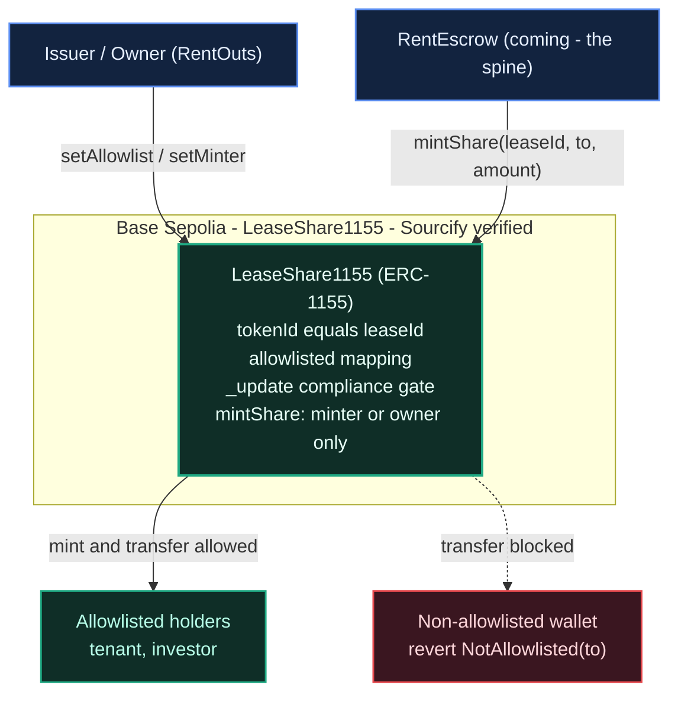

# RentOuts — On-Chain Rental Escrow (ETHGlobal Tokyo 2026)

> **Trust-minimized rental escrow** — part of [RentOuts](https://rentouts.co), a blockchain-powered rental marketplace. Deposits and rent are held in USDC by a smart contract (not a landlord), and released/refunded on agreed conditions. Built live at **ETHGlobal Tokyo 2026** (Sep 25–27).

**Status:** 🟢 Building during the event. Existing product (the RentOuts marketplace is live); the on-chain escrow + sponsor integrations here are the new hackathon work (Continuity Track).

## What's in this repo

| Path | What |
| --- | --- |
| `src/LeaseShare1155.sol` | **RWA lease-share token** — ERC-1155 tokenizing a lease/deposit with compliance-aware (allowlist) transfers |
| `test/LeaseShare1155.t.sol` | Foundry tests incl. a fuzz proving non-allowlisted recipients are always rejected |
| `script/DeployLeaseShare.s.sol` | Base Sepolia deploy script |
| `deployments.json` | Live contract addresses |
| [`ARCHITECTURE.md`](./ARCHITECTURE.md) | Design + diagrams for the deployed contract |

_Coming during the event: `RentEscrow.sol` (USDC escrow + World ID gate) and `RentoutsSubnames` (ENSv2 identity)._

---

## 🏦 Curvegrid — Best RWA Tokenization Project

**One-sentence summary:** RentOuts tokenizes a rental lease/deposit as an ERC-1155 real-world asset whose shares can only move between compliance-approved (allowlisted) wallets — the on-chain building block for fractional, transfer-restricted rental ownership.

- **What it does:** `LeaseShare1155` mints a share per lease (`tokenId == leaseId`). Every transfer — single **and batch** — runs through an allowlist check in the OZ v5 `_update` hook, so shares can only be received by KYC/eligibility-approved addresses — "compliance-aware transfer logic" for real-estate RWAs. Revoking an address blocks further transfers to it immediately.
- **How this maps to the product:** it's a minimal cut of RentOuts' Stage-3 investor surface (permissioned ERC-1155 lease shares + transfer agent, Reg D 506(c)/Reg S).
- **MultiBaas:** _(optional — TBD)_ we may register the deployed contract in MultiBaas and read balances via its REST API for the demo dashboard.
- **MultiBaas feedback:** _TBD_

### 🟢 Live on Base Sepolia

| | |
| --- | --- |
| Contract | [`0x5490e5dFcDcA741aC99127f66B4abf6204cd64C5`](https://sepolia.basescan.org/address/0x5490e5dFcDcA741aC99127f66B4abf6204cd64C5) |
| Network | Base Sepolia (chainId 84532) |
| Source | verified via Sourcify |
| Deploy tx | [`0x76164bf8…332400c`](https://sepolia.basescan.org/tx/0x76164bf89428462ed9b8220f609cefa101efce9d4a8d677d16a27083c332400c) |

**On-chain compliance demo (real transactions):**
- Mint 1000 shares of lease #1 — [`0x87be65…b95a29`](https://sepolia.basescan.org/tx/0x87be65e59b2bff356269d8e2cfe5c4a0d5b51f9ca793ad138e64c40342b95a29)
- Allowlist recipient `0x…bEEF` — [`0xbb1396…f8c07a4`](https://sepolia.basescan.org/tx/0xbb1396555cf4d02c14e4eeed1209c448eae1a76de3955fa86d5f87ec2f8c07a4)
- **Allowlisted** transfer of 400 succeeds — [`0x34227e…442dddce`](https://sepolia.basescan.org/tx/0x34227e62ef9b0002589e5827114932960eed8ea54089ccae38bd41ae442dddce)
- **Non-allowlisted** transfer reverts `NotAllowlisted` (compliance gate holds)

Resulting balances: issuer 600, allowlisted recipient 400, totalSupply 1000.

### Team
- [@AiAlchemist0](https://github.com/AiAlchemist0) (Dean) — contracts / RWA
- Bektur — ENS identity

---

## ENS identity (ENSv2, Ethereum Sepolia)

Tenants get a soulbound `<name>.rentouts.eth` subname on the ENSv2 beta. Its `rentouts.*` text records carry the rental credential: only RentOuts issuers can write them, and any ENSv2-aware app can read them through the Universal Resolver. `CredentialSync.sync(tenant)` is permissionless and derives the track-record keys on-chain from `RentEscrow.tenantStats`. It is a separate Foundry project in [`ens/`](./ens). Design, records, trust model and run steps: **[ens/README.md](./ens/README.md)**.

| Ethereum Sepolia (11155111), testnet only | |
| --- | --- |
| `rentouts.eth` resolver (`PermissionedResolver`) | [`0xBB8A105f48Ac836F549eC0B6A1a45BB7BA0961E5`](https://sepolia.etherscan.io/address/0xBB8A105f48Ac836F549eC0B6A1a45BB7BA0961E5) |
| Subname registry (`UserRegistry`) | [`0xD2D122000D4725a863376EcAe4220BC20590f382`](https://sepolia.etherscan.io/address/0xD2D122000D4725a863376EcAe4220BC20590f382) |
| `RentoutsSubnames` | [`0xd7bDB1EeDa6AEDf59B3868D048e75cC3dBFDFf60`](https://sepolia.etherscan.io/address/0xd7bDB1EeDa6AEDf59B3868D048e75cC3dBFDFf60) |
| Demo credential | `alice.rentouts.eth` |

`CredentialSync` is not deployed yet: it needs the RentEscrow address. Addresses for the app: [`ens/deployments/sepolia.json`](./ens/deployments/sepolia.json).

---

## Architecture

Full write-up + diagrams: **[ARCHITECTURE.md](./ARCHITECTURE.md)**. `LeaseShare1155` tokenizes a lease/deposit as a permissioned ERC-1155 (`tokenId == leaseId`); every recipient is checked against a compliance allowlist in the OZ v5 `_update` hook, so shares can only move between approved wallets.



---

## Setup & testing

Requires [Foundry](https://getfoundry.sh).

```bash
# 1. Install dependencies (OpenZeppelin v5)
forge install OpenZeppelin/openzeppelin-contracts@v5.1.0 --no-commit

# 2. Build + test
forge build
forge test -vv
```

Expected: **12 passing** tests — mint/transfer/batch allowlist gating, revoke-mid-life, access control, and `testFuzz_TransferToRandom_RejectedUnlessAllowlisted` (256 runs) proving the compliance gate.

### Deploy to Base Sepolia

```bash
cp .env.example .env   # fill in PRIVATE_KEY (a fresh testnet EOA), RPC, Basescan key
source .env
forge script script/DeployLeaseShare.s.sol --rpc-url base_sepolia --broadcast --verify
```

## Links
- Product: https://rentouts.co
- Demo video: _coming soon (ETHGlobal submission)_

## License
[MIT](./LICENSE)
