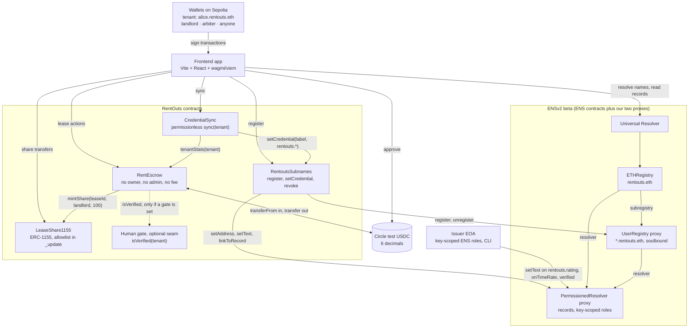
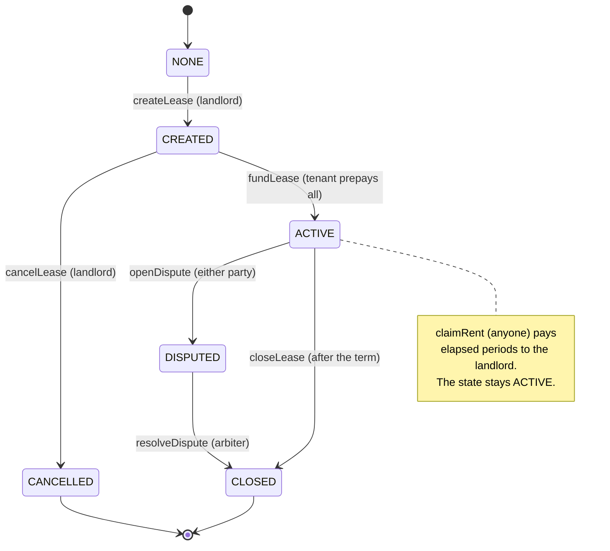
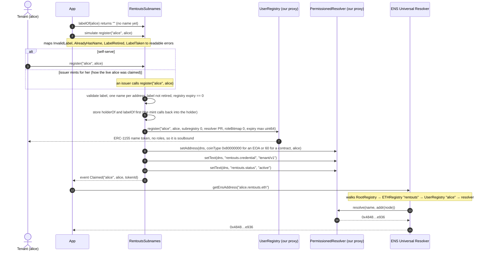
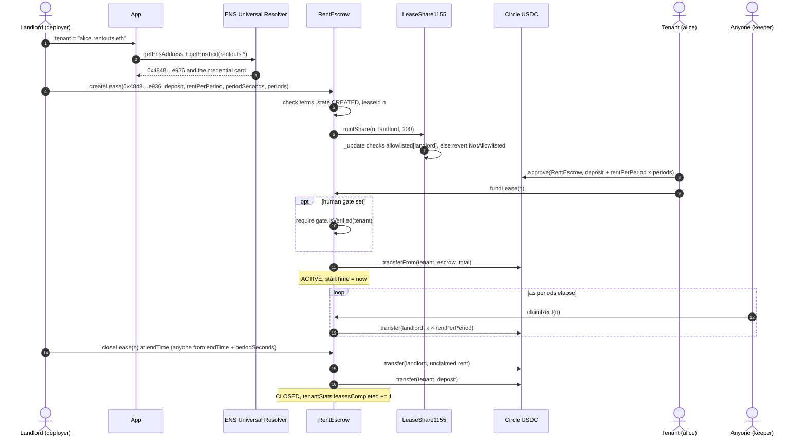
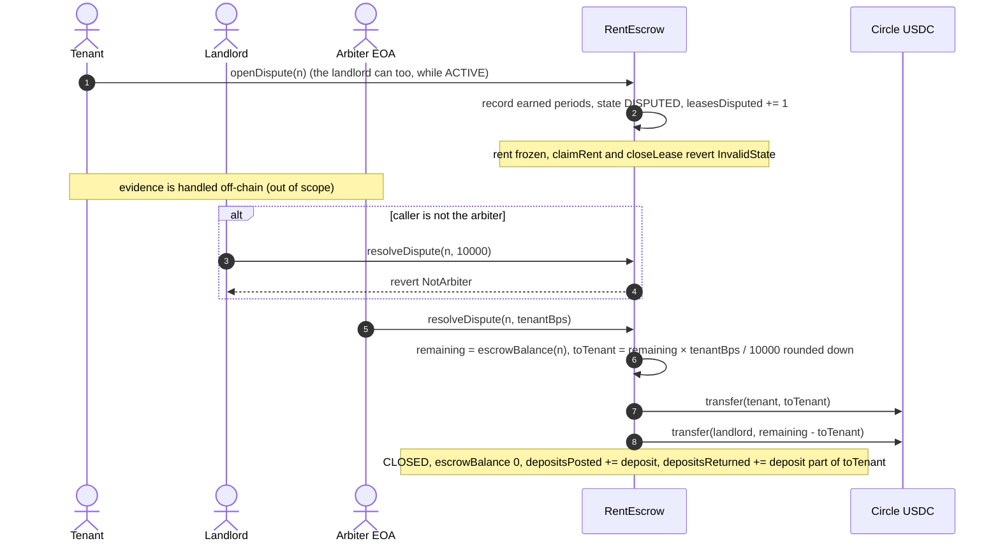
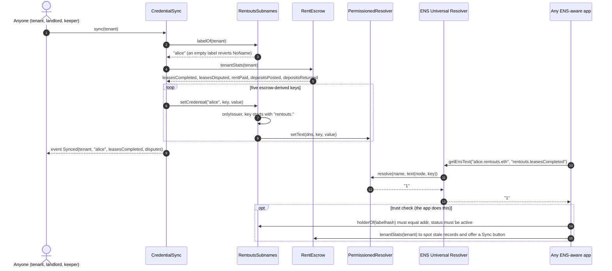
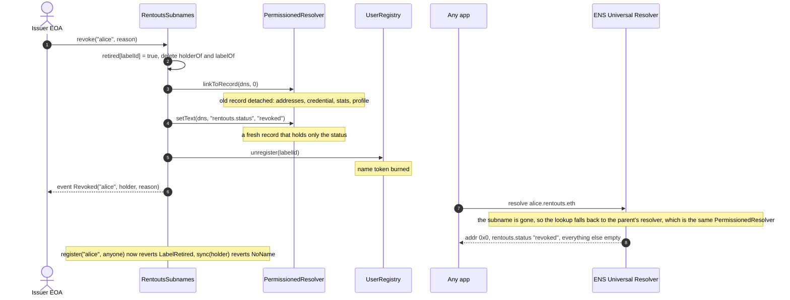
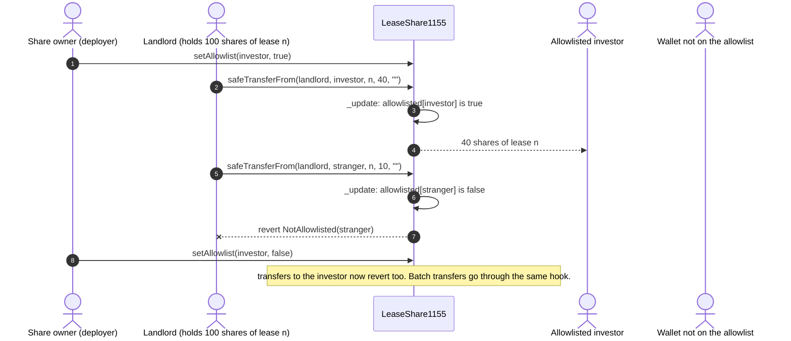

# RentOuts Escrow: architecture

ETHGlobal Tokyo 2026 · **Ethereum Sepolia testnet only** · Circle test USDC · MIT

Written for judges and code reviewers; about a 10-minute read. Companion docs: [DECISIONS.md](./DECISIONS.md) (why), [PLAN.md](./PLAN.md) (scope and timeline), [DEMO.md](./DEMO.md) (the 3-minute demo).

<!-- VERIFY: links into src/, test/, script/, ens/ and app/ resolve only after feat/core-escrow, ens-integration and feat/app are merged into main. -->

---

## 1. Summary

RentOuts Escrow adds an on-chain rental layer to [RentOuts](https://rentouts.co), an existing rental marketplace. A landlord proposes a lease to a tenant by ENS name, and the tenant prepays the deposit and every period's rent in Circle test USDC into `RentEscrow`. That contract has no owner, admin or fee. It releases rent to the landlord one period at a time and returns the deposit at the end. A fixed arbiter can do exactly one thing: split a disputed lease's remaining escrow between that lease's tenant and landlord. Each new lease mints 100 `LeaseShare1155` shares to the landlord. They are ERC-1155 real-world-asset tokens that only move between compliance-allowlisted wallets. The tenant's identity is a soulbound ENSv2 subname such as `alice.rentouts.eth`. A permissionless `CredentialSync.sync(tenant)` writes the tenant's track record into `rentouts.*` text records, reading it straight from the escrow. Any ENS-aware app can then read the credential through the ENS Universal Resolver, with no RentOuts API involved. Everything runs on one chain, Ethereum Sepolia (11155111), because that is the only place the ENSv2 beta exists.

**Status (Fri 2026-09-25, 23:15 JST):** the ENS layer is live (`rentouts.eth`, `RentoutsSubnames`, `alice.rentouts.eth`). `RentEscrow`, the integrated `LeaseShare1155` and `CredentialSync` are being deployed next (see [§8](#8-deployments)).

---

## 2. Component map



<!-- VERIFY: the human gate seam is being added to RentEscrow (gate address, 0 = disabled). Confirm the final name/interface before submission. -->

| Component | Source | What it does |
|---|---|---|
| `RentEscrow` | [`src/RentEscrow.sol`](../src/RentEscrow.sol), interface [`src/interfaces/IRentEscrow.sol`](../src/interfaces/IRentEscrow.sol) | Holds each lease's USDC and runs the lease state machine ([§4](#4-lease-lifecycle)). Keeps per-tenant `tenantStats`. `token`, `arbiter` and `leaseShare` are immutable. |
| `LeaseShare1155` | [`src/LeaseShare1155.sol`](../src/LeaseShare1155.sol) | ERC-1155 lease shares with `tokenId == leaseId`. The allowlist check sits in OpenZeppelin v5's `_update` hook, so it covers mints, single transfers and batch transfers. `RentEscrow` is its minter. |
| `RentoutsSubnames` | [`ens/src/RentoutsSubnames.sol`](../ens/src/RentoutsSubnames.sol) | Issues `<label>.rentouts.eth`. It holds root `REGISTRAR`, `UNREGISTER` and `RENEW` on our `UserRegistry`, and root `SET_ADDRESS`, `SET_TEXT` and `LINK` on our `PermissionedResolver`. It enforces who may write which record. |
| `CredentialSync` | [`ens/src/CredentialSync.sol`](../ens/src/CredentialSync.sol) | `sync(tenant)`: reads `RentEscrow.tenantStats(tenant)` and writes five `rentouts.*` records. It is an issuer on `RentoutsSubnames`. |
| ENSv2 (ENS's code) | `ensdomains/contracts-v2`, tag `sepolia-deployment-2026-09-15`; interfaces vendored in [`ens/src/interfaces/IENSv2.sol`](../ens/src/interfaces/IENSv2.sol) | `ETHRegistry` holds `rentouts.eth`. Its subregistry is our `UserRegistry` proxy and its resolver is our `PermissionedResolver` proxy, both deployed through ENS's `VerifiableFactory`. The Universal Resolver walks that tree. |
| App | [`app/`](../app/) | 5-step wizard: claim name, create lease, fund, run the lease (claim / close / dispute / resolve / sync), lease shares. Every write is simulated first, so a revert shows as a readable error before MetaMask opens. |
| Deploy tooling | [`script/DeployEscrow.s.sol`](../script/DeployEscrow.s.sol), [`ens/script/DeployEns.s.sol`](../ens/script/DeployEns.s.sol), [`ens/scripts/ens.sh`](../ens/scripts/ens.sh) | Foundry scripts that sign with an encrypted keystore (`--account`), never a raw private key. The ENS phases are re-runnable, and the wrapper dry-runs unless `BROADCAST=true`. |

**How a name resolves.** `getEnsAddress("alice.rentouts.eth")` in viem calls the Universal Resolver `0xeEeE…EeEe`. The Universal Resolver walks `RootRegistry → ETHRegistry ("rentouts") → our UserRegistry ("alice")` to find the resolver, then calls `PermissionedResolver.resolve(name, addr(node))`. The app reads ENS addresses from `ens/deployments/sepolia.json` and the parent name from `RentoutsSubnames.parentName()`, so no ENS address is hard-coded in the app's code.

---

## 3. Roles and trust model

| Role | Account | Can | Cannot |
|---|---|---|---|
| **Tenant** | e.g. alice `0x4848…e936` | Claim one name for itself (`register(label, self)`). Edit allowlisted profile keys (`avatar`, `description`, `url`, `com.twitter`, `com.github`) through `setProfileText`. `fundLease` on leases where it is the tenant. `openDispute` on its `ACTIVE` leases. Call `claimRent`, `closeLease` (after the grace period) and `sync` like anyone. | Transfer, detach or burn its name (no token roles). Write any `rentouts.*` record (ENS reverts `EACUnauthorizedAccountRoles`). Withdraw prepaid rent or the deposit early; the only way out before the term ends is a dispute. |
| **Landlord** | e.g. the deployer `0xdD9c…CCCE` in the demo | `createLease` (must be on the `LeaseShare1155` allowlist and must not be the arbiter). `cancelLease` before funding. `claimRent`. `closeLease` from `endTime`. `openDispute`. Transfer its lease shares to allowlisted wallets. | Take rent ahead of elapsed periods (INV-3). Keep the deposit without a dispute. Redirect rent by transferring shares: rent always goes to `lease.landlord`. Send shares to a wallet that is not allowlisted. |
| **Arbiter** | EOA `0x798b…e486` (a Safe in production) | `resolveDispute(id, tenantBps)` on a `DISPUTED` lease: `⌊remaining × tenantBps / 10000⌋` goes to the tenant and the rest to the landlord. | Pay anyone other than that lease's two parties (INV-1). Pay out more or less than the remaining escrow (INV-4). Act on a lease that is not `DISPUTED`, or open a dispute. Be a landlord or tenant: `createLease` reverts `InvalidTerms`, and `DeployEscrow` refuses arbiter == deployer. Trust assumption: the arbiter chooses the split, and a disputed lease stays frozen until it rules (no timeout). |
| **Deployer / admin** | `0xdD9c…CCCE` (keystore `rentouts-deployer`) | `RentoutsSubnames` admin: `setIssuer`, `setProfileKey` (never `rentouts.*`), `transferAdmin`. It is also an issuer. It owns `rentouts.eth` and holds all root roles (`ALL_ROLES`, including upgrade) on our `UserRegistry` and `PermissionedResolver` proxies, so it can rewrite any record, register or unregister any subname, and upgrade those proxies. It owns the integrated `LeaseShare1155`: `setAllowlist`, `setMinter`, and it can mint shares directly. | Touch escrowed USDC, change the escrow's token or arbiter, pause the escrow or take a fee: `RentEscrow` has no owner. Move shares to a wallet that is not allowlisted. **This is the largest trust assumption on the identity side**. In production it would be a Safe that drops the roles it doesn't need. |
| **Issuer EOA** | `0xF604…13C4` (keystore `rentouts-issuer`) | On `RentoutsSubnames`: `register` a name for any holder, `setCredential` on any `rentouts.*` key, `revoke`. Directly on the resolver, through key-scoped ENS roles: write `rentouts.onTimeRate`, `rentouts.rating` and `rentouts.verified`. | Write `avatar` or any key it wasn't granted directly on the resolver (ENS EAC reverts; checked live, see [DEMO.md](./DEMO.md#optional-cli-proofs)). Write non-`rentouts.*` keys through the contract. Transfer names or touch the escrow. It *can* overwrite escrow-derived keys through `setCredential` until the admin removes it, and a later `sync` restores them. |
| **CredentialSync** | contract (pending) | For a tenant with an active name, write exactly five keys (`rentouts.leasesCompleted`, `disputes`, `rentPaid`, `depositReturnRate`, `escrow`), computed from `tenantStats`. | Choose the values: they are a pure function of public escrow state. Register or revoke names, or write any other key: its code has no other path. If the admin removes it as an issuer, `sync` reverts `NotIssuer`. |
| **Anyone** | any address | `claimRent(id)` (pays only the landlord). `closeLease(id)` from `endTime + periodSeconds`. `CredentialSync.sync(tenant)`. Read every record through the Universal Resolver and every lease through `getLease` / `tenantStats`. | Move any funds to itself. Register a name for someone else (only the holder or an issuer can). |
| **Human gate** (optional) | contract address or `0` | When set, `fundLease` requires `isVerified(tenant)`. | Anything else: a view call on the funding path only. |

<!-- VERIFY: issuer EOA resolver roles. A live roles() read at 23:10 JST still shows SET_TEXT on rentouts.leasesCompleted, rentouts.disputes and rentouts.escrow. The cleanup (BROADCAST=true ./scripts/ens.sh subnames, 3 revokeRoles txs) has not been broadcast yet. After it, the issuer should hold only onTimeRate, rating and verified. -->
<!-- VERIFY: human gate row. The seam is not in RentEscrow yet; confirm the constructor parameter name and the revert error once it lands. -->

**The trust model in three lines.**
- **Money:** trust the code (no admin path to funds), plus the arbiter's judgment on disputed leases only.
- **Credentials:** anyone can check the escrow-derived records against `RentEscrow.tenantStats` and restore them with `sync`. RentOuts (the issuers and the admin) can still overwrite or revoke. The judged keys (`rating`, `onTimeRate`, `verified`) are RentOuts' word.
- **Shares:** trust the `LeaseShare1155` owner's allowlist, which stands in for KYC/eligibility.

---

## 4. Lease lifecycle



`endTime = startTime + periods × periodSeconds`. `startTime` is set by `fundLease`.

| Transition | Call | Caller | Guards (revert) | Money and side effects |
|---|---|---|---|---|
| NONE → CREATED | `createLease(tenant, deposit, rentPerPeriod, periodSeconds, periods)` | landlord (`msg.sender`) | `tenant ≠ 0`, `tenant ≠ landlord`, neither party is the arbiter, `deposit + rentPerPeriod > 0`, `periods ≥ 1`, `periodSeconds ≥ MIN_PERIOD (60)`, total fits in `uint128`, else `InvalidTerms`. With shares enabled, the landlord must be allowlisted (`NotAllowlisted`). | No money moves. Mints 100 shares of `tokenId = leaseId` to the landlord. Ids start at 1. |
| CREATED → CANCELLED | `cancelLease(id)` | landlord | state `CREATED` (`InvalidState`), caller is the landlord (`NotLandlord`) | No money moves. The shares stay with the landlord (there is no burn). |
| CREATED → ACTIVE | `fundLease(id)` | tenant | `CREATED`, caller is the tenant (`NotTenant`), USDC allowance ≥ total. If a gate is set: `isVerified(tenant)`. | Pulls `deposit + rentPerPeriod × periods` from the tenant. The clock starts. `leasesFunded += 1`. |
| ACTIVE → ACTIVE | `claimRent(id)` | anyone | `ACTIVE`, at least one elapsed, unclaimed period (`NothingToClaim`) | `k × rentPerPeriod` to the landlord. `periodsPaid` and `rentPaid` grow. |
| ACTIVE → DISPUTED | `openDispute(id)` | tenant or landlord | `ACTIVE`, caller is a party (`NotParty`) | No money moves. Rent is frozen: `claimRent` and `closeLease` revert. Records the periods earned so far. `leasesDisputed += 1`. |
| ACTIVE → CLOSED | `closeLease(id)` | landlord from `endTime`, anyone from `endTime + periodSeconds` | `ACTIVE`, `TermNotOver` | Unclaimed rent goes to the landlord and the deposit to the tenant. `leasesCompleted += 1`. The one-period grace window gives the landlord time to dispute the deposit. |
| DISPUTED → CLOSED | `resolveDispute(id, tenantBps)` | arbiter | caller is the arbiter (`NotArbiter`), `tenantBps ≤ 10000` (`InvalidBps`), `DISPUTED` | `⌊remaining × tenantBps / 10000⌋` goes to the tenant and the rest to the landlord. `depositsPosted += deposit`. `depositsReturned` counts only the deposit part of the tenant's payout (see [§7](#7-ens-record-schema)). |

<!-- VERIFY: fundLease human-gate guard (seam being added; not in RentEscrow as of feat/core-escrow fd9ba6f). -->

Every mutating function is `nonReentrant` and follows checks-effects-interactions. `claimable(id)` and `endTime(id)` are views that drive the UI's countdowns.

---

## 5. Flows

### (a) Claim an identity: `alice.rentouts.eth`



The live `alice.rentouts.eth` was claimed in tx [`0x882d63a5…7500`](https://sepolia.etherscan.io/tx/0x882d63a54d344760d5a10dd2455c25796ca3b930e7db50c96d9dea7b5f947500) and passed the ENS go/no-go gate at Fri 22:24 JST. The ENSIP-19 default address record means the same name also resolves on Base (coin type `0x80000000 | 84532`).

### (b) Landlord leases to an ENS name, tenant funds, rent flows, lease closes



The ENS name is resolved once, in the app. The lease stores the tenant's address, not the name.

### (c) Dispute and arbiter split



### (d) Credential sync: escrow → ENS → any app



A sync writes 5 text records: about 350k gas for the first write and about 210k gas for a refresh (fork-test gas report). Records only change when someone calls `sync`. The app compares them with `tenantStats` and shows a Sync button when they are behind.

### (e) Revoke: wipe, burn, retire



The wipe matters because the subname shares its parent's resolver. Without `linkToRecord(name, 0)`, the Universal Resolver would still find the old records through `rentouts.eth` after `unregister`. Labels are single-use: even a redeployed `RentoutsSubnames` refuses them, because ENS never resets a used label's expiry to 0. The holder can claim a fresh label, such as `alice-2`.

### (f) Compliant share transfer



The app simulates the transfer first, so a transfer to a wallet that isn't allowlisted shows `NotAllowlisted` before MetaMask opens. A share records a position in a lease; it is not a claim on cash flows. Rent goes to `lease.landlord`, not pro rata to share holders. The same flow is live on Base Sepolia as a standalone proof ([§8](#8-deployments)).

---

## 6. Invariants and how they are tested

Declared in `IRentEscrow` and checked by the handler-based suite [`test/RentEscrow.invariant.t.sol`](../test/RentEscrow.invariant.t.sol). The handler runs random create / cancel / fund / warp / claim / close / dispute / resolve sequences across four actors, a keeper and the arbiter. It books every token transfer out of the escrow from the token's own `Transfer` logs, not from the escrow's bookkeeping. Settings: 64 runs × 64 calls, `fail_on_revert = true` (the handler only makes valid calls, so any revert is a bug).

| ID | Invariant | How the suite checks it |
|---|---|---|
| **INV-1** | Funds only ever move to the lease's tenant or landlord (no owner, no fee, no admin). | No escrow transfer goes to a non-party, and claim/close pay each party exactly what it is owed. Each actor's balance equals minted − escrowed + received. The arbiter, the keeper and the share issuer never hold a token. |
| **INV-2** | `Σ escrowBalance(leaseId) == usdc.balanceOf(escrow)` | Sums every lease. `ACTIVE` and `DISPUTED` leases hold exactly `deposit + rentPerPeriod × unclaimed periods`; every other state holds 0. |
| **INV-3** | Rent released for a lease never exceeds `rentPerPeriod × elapsed periods` (capped at the term). | A ghost ledger of rent actually transferred per lease, checked against the elapsed periods since `startTime`. `periodsClaimed ≤ elapsed`. |
| **INV-4** | A dispute resolution pays out exactly the lease's remaining escrow, split tenant/landlord. | The payout equals the escrow at resolve time, the balance is 0 afterwards and the state is `CLOSED`. |

Mutation check (from the core README): each of these injected bugs makes the suite fail: dropping the term cap, paying the arbiter, leaving a closed lease's balance, and rounding the split up.

Other suites:

- **`RentEscrow` unit and fuzz** ([`test/RentEscrow.t.sol`](../test/RentEscrow.t.sol)): every function and exact custom-error revert, partial and complete claims with `vm.warp`, the close grace rule, 0 / 5000 / 10000 bps splits plus a fuzzed split, share minting and the non-allowlisted-landlord revert, re-entry through the ERC-1155 receive hook, the arbiter never being a party, and tenant-stats accounting.
- **`DeployEscrow`** ([`test/DeployEscrow.t.sol`](../test/DeployEscrow.t.sol)): arbiter ≠ deployer, one `LeaseShare1155` per escrow, nothing is recorded outside a real broadcast.
- **`LeaseShare1155`** ([`test/LeaseShare1155.t.sol`](../test/LeaseShare1155.t.sol)): mint, transfer and batch allowlist gating, an allowlist revoked mid-life, access control, and a 256-run fuzz that proves non-allowlisted recipients are always rejected.
- **ENS fork tests against live ENSv2 on Sepolia** ([`ens/test/`](../ens/test/)). They deploy fresh proxies and register a random parent inside the fork. Coverage: soulbound (`unsafeTransfer` → `TransferDisallowed`, plus a positive control that proves the gate), the holder can't detach or burn, issuer key-scoped roles enforced by ENS (the issuer writes `rentouts.onTimeRate` and reverts on `avatar`; the holder can't forge), revoke wipes, burns and retires, labels stay blocked across a redeploy, `sync` is permissionless, restores overwritten values and reverts after revoke or when not an issuer, and the deploy script grants judged keys only.
- **App** (`app/src/lib/*.test.ts`, vitest): the credential trust check, error mapping, formatting and label validation.

Counts at the time of writing (Fri 23:20 JST): root package `RentEscrow` 45 unit/fuzz tests, `DeployEscrow` 8, `LeaseShare1155` 12, plus the 4-invariant campaign; `ens/` 30 fork tests (`RentoutsSubnames` 18, `CredentialSync` 10, `DeployEnsRoles` 2). All green.
<!-- VERIFY: test counts. They move with feat/core-escrow and ens-integration, so re-count after merge (forge test --summary). -->

---

## 7. ENS record schema

Records for `<label>.rentouts.eth`. They all live in one shared `PermissionedResolver`.

| Key | Written by | Value | Example |
|---|---|---|---|
| `addr` | `RentoutsSubnames.register` | the holder. EOAs get the ENSIP-19 default EVM record (`0x80000000`), which resolves on every EVM chain; contract wallets get coin 60 only. | `0x4848…e936` |
| `rentouts.credential` | `RentoutsSubnames.register` | credential schema version | `tenant/v1` |
| `rentouts.status` | `RentoutsSubnames` (register / revoke) | lifecycle | `active` / `revoked` |
| `rentouts.leasesCompleted` | `CredentialSync.sync` | `tenantStats.leasesCompleted` (closed without a dispute) | `3` |
| `rentouts.disputes` | `CredentialSync.sync` | `tenantStats.leasesDisputed` (opened by either party) | `0` |
| `rentouts.rentPaid` | `CredentialSync.sync` | `tenantStats.rentPaid`, USDC with 2 decimals, rounded down | `1250.00` |
| `rentouts.depositReturnRate` | `CredentialSync.sync` | `depositsReturned × 100 / depositsPosted`, whole percent, rounded down, capped at 100. `n/a` until a lease with a deposit has ended. In a dispute, the tenant's payout counts first as a refund of rent not yet earned, then as deposit, then as earned rent; only the deposit part counts as returned. | `100`, `50`, `n/a` |
| `rentouts.escrow` | `CredentialSync.sync` | CAIP-10 id of the escrow the stats come from | `eip155:11155111:0x…` (lowercase) |
| `rentouts.onTimeRate`, `rentouts.rating`, `rentouts.verified` | issuer EOA (key-scoped ENS role, or `setCredential`) | judgments the escrow can't derive | `100`, `5`, `true` |
| `avatar`, `description`, `url`, `com.twitter`, `com.github` | holder, via `setProfileText` | profile (admin-editable allowlist, never `rentouts.*`) | … |

<!-- VERIFY: depositReturnRate dispute rule. Core commit 2018dcf changed the attribution (unearned rent first, then deposit). ens/README.md still documents the old "capped at the deposit" rule and its LOG open item; drop that caveat when ens-integration is updated. -->

Parent `rentouts.eth` records: `addr` = `0x7ed696c879a1a7FD2eD3b49d9982E634a8647eb1` (RentOuts' published address), `url` = `https://rentouts.co`, `email` = `partners@rentouts.co`, `com.twitter` = `RentOuts`, and `description`.

**Reader rule.** Show `rentouts.*` values only when `rentouts.status == "active"` and `addr(name)` equals `RentoutsSubnames.holderOf(labelhash)`. The app's credential card enforces this in `app/src/lib/credential.ts`.

---

## 8. Deployments

**Ethereum Sepolia (11155111).** Machine-readable copies: [`ens/deployments/sepolia.json`](../ens/deployments/sepolia.json) (ENS), and `deployments/sepolia.json`, which `DeployEscrow` writes on broadcast (escrow).

| What | Address | Status |
|---|---|---|
| `rentouts.eth` (in ENS `ETHRegistry`) | owner `0xdD9c17ecAe9301b67De17F1ba2b5084EaC59CCCE`, expires 2027-09-25; registered in [`0x7100160a…ca7b`](https://sepolia.etherscan.io/tx/0x7100160abf684418f7c00b60e3a839662c6de1cae1db2bf57cd59210f125ca7b) | 🟢 live |
| `PermissionedResolver` proxy (ours) | [`0xBB8A105f48Ac836F549eC0B6A1a45BB7BA0961E5`](https://sepolia.etherscan.io/address/0xBB8A105f48Ac836F549eC0B6A1a45BB7BA0961E5) | 🟢 live |
| `UserRegistry` proxy (ours) | [`0xD2D122000D4725a863376EcAe4220BC20590f382`](https://sepolia.etherscan.io/address/0xD2D122000D4725a863376EcAe4220BC20590f382) | 🟢 live |
| `RentoutsSubnames` | [`0xd7bDB1EeDa6AEDf59B3868D048e75cC3dBFDFf60`](https://eth-sepolia.blockscout.com/address/0xd7bDB1EeDa6AEDf59B3868D048e75cC3dBFDFf60) | 🟢 live, source verified (Sourcify `exact_match`) |
| `alice.rentouts.eth` (demo tenant) | resolves to [`0x484811c8c967809bE644A89d677933c29fb9e936`](https://sepolia.etherscan.io/address/0x484811c8c967809bE644A89d677933c29fb9e936); claimed in [`0x882d63a5…7500`](https://sepolia.etherscan.io/tx/0x882d63a54d344760d5a10dd2455c25796ca3b930e7db50c96d9dea7b5f947500) | 🟢 live |
| Issuer EOA | [`0xF6048B190D178Fb6F0870c65CD2F7E06381713C4`](https://sepolia.etherscan.io/address/0xF6048B190D178Fb6F0870c65CD2F7E06381713C4) | 🟢 live (role cleanup pending) |
| Arbiter EOA | [`0x798b01Cef62b889943Ce1D3C5011a755B297e486`](https://sepolia.etherscan.io/address/0x798b01Cef62b889943Ce1D3C5011a755B297e486) | 🟡 account ready; becomes the arbiter when `RentEscrow` is deployed |
| `RentEscrow` | _pending_ | 🟡 deploying |
| `LeaseShare1155` (integrated, minter = `RentEscrow`) | _pending_ | 🟡 deploying together with `RentEscrow` |
| `CredentialSync` | _pending_ | 🟡 deploying after `RentEscrow` (`./scripts/ens.sh credentialSync`) |
| Human gate | _none_ (`0` = disabled) | ⏸ deferred to Saturday |
| Circle test USDC (Circle's) | [`0x1c7D4B196Cb0C7B01d743Fbc6116a902379C7238`](https://sepolia.etherscan.io/address/0x1c7D4B196Cb0C7B01d743Fbc6116a902379C7238) | 🟢 external, 6 decimals |
| ENS Universal Resolver (ENS's) | [`0xeEeEEEeE14D718C2B47D9923Deab1335E144EeEe`](https://sepolia.etherscan.io/address/0xeEeEEEeE14D718C2B47D9923Deab1335E144EeEe) | 🟢 external |
| ENS `ETHRegistry` (ENS's) | [`0x657eA849311d3D5823348ddEd7C2AaAFb3EDE09E`](https://sepolia.etherscan.io/address/0x657eA849311d3D5823348ddEd7C2AaAFb3EDE09E) | 🟢 external |

<!-- VERIFY: fill in RentEscrow, LeaseShare1155 (Sepolia) and CredentialSync addresses and deploy tx links after deployment; confirm source verification. -->
<!-- VERIFY: arbiter EOA 0x798b…e486 is the ESCROW_ARBITER actually used at deploy (check RentEscrow.arbiter()). -->

**Base Sepolia (84532), standalone Curvegrid proof.** This `LeaseShare1155` is not wired to an escrow. The integrated one is the Sepolia deploy above.

| What | Link |
|---|---|
| `LeaseShare1155` | [`0x5490e5dFcDcA741aC99127f66B4abf6204cd64C5`](https://sepolia.basescan.org/address/0x5490e5dFcDcA741aC99127f66B4abf6204cd64C5) (Sourcify verified), deploy tx [`0x76164bf8…400c`](https://sepolia.basescan.org/tx/0x76164bf89428462ed9b8220f609cefa101efce9d4a8d677d16a27083c332400c) |
| Mint 1000 shares of lease #1 | [`0x87be65e5…5a29`](https://sepolia.basescan.org/tx/0x87be65e59b2bff356269d8e2cfe5c4a0d5b51f9ca793ad138e64c40342b95a29) |
| Allowlist a recipient | [`0xbb139655…c07a4`](https://sepolia.basescan.org/tx/0xbb1396555cf4d02c14e4eeed1209c448eae1a76de3955fa86d5f87ec2f8c07a4) |
| Transfer 400 to the allowlisted recipient (succeeds) | [`0x34227e62…dddce`](https://sepolia.basescan.org/tx/0x34227e62ef9b0002589e5827114932960eed8ea54089ccae38bd41ae442dddce) |
| Transfer to a non-allowlisted recipient | reverts `NotAllowlisted` |

---

## 9. Security notes and known limitations

**Scope and honesty**
- **Testnet only.** Ethereum Sepolia and **Circle's test USDC**. This is hackathon code and it has not been audited.
- **No custody by RentOuts.** `RentEscrow` has no owner, admin, fee or upgrade path, and its token, arbiter and share contract are immutable. RentOuts never holds tenant funds.
- **All code in this repo was written during the event.** A design brief ([`docs/ens/HANDOFF.md`](./ens/HANDOFF.md)) was prepared in a design session at the event, and the running decision log is [`docs/ens/LOG.md`](./ens/LOG.md). AI assistance is recorded in [`ens/AI_USAGE.md`](../ens/AI_USAGE.md).

**Escrow**
- **Single-EOA arbiter.** It can't pay anyone but the two parties and can't be a party itself. It still chooses the split, and a disputed lease stays frozen until it rules (no timeout). In production this would be a Safe multisig.
- **Prepay only.** The tenant locks the deposit plus all rent at `fundLease`. That keeps the state machine and the invariants small, and it suits short demo leases, but a real lease needs installments or streaming. With no late-payment state, `rentouts.onTimeRate` can't be derived and stays an issuer judgment.
- **Timing uses `block.timestamp`.** Periods are at least 60 s, so a few seconds of drift don't matter.
- **The token must be a plain ERC-20**, with no fee-on-transfer or rebasing (USDC qualifies).

**Lease shares**
- **Shares are not cash-flow rights.** Rent goes to `lease.landlord` whoever holds the shares; a share records the lease position.
- **The share owner is trusted.** It sets the allowlist (the KYC stand-in), can change the minter and can mint directly. Shares of a cancelled lease stay with the landlord (there is no burn). One `LeaseShare1155` per `RentEscrow`, because lease ids restart at 1 in every escrow.
- **Contract recipients must implement `onERC1155Received`.** That includes a landlord whose `createLease` mints shares.

**ENS identity**
- **The ENS admin is powerful.** The deployer holds all root roles on our `UserRegistry` and `PermissionedResolver` proxies (it can rewrite records and upgrade them) and admins `RentoutsSubnames`. Issuers can overwrite escrow-derived records until they are removed, and `sync` restores them. Names are deliberately not emancipated, so they stay revocable.
- **EIP-7702-delegated wallets.** A subname is an ERC-1155 token. An address with delegation code that doesn't implement `onERC1155Received` can't receive a name, and the same applies to lease shares. Some well-known test EOAs on Sepolia are delegated this way. The app warns when the connected account has code.
- **Sepolia ENS resets.** ENS resets the Sepolia v2 beta every few weeks, which would wipe `rentouts.eth` and every subname. All ENS phases are re-runnable, and [`ens/script/EnsSepolia.sol`](../ens/script/EnsSepolia.sol) is the only file to update for a new ENS tag.
- **Records go stale until someone syncs.** Nothing pushes updates, so after a lease closes someone has to call `sync`. The app shows when ENS is behind the escrow.
- **Availability heuristics.** A null `getEnsAddress` doesn't mean a label is free, because revoked labels resolve to null too. The app simulates `register` instead.
- **Some ENS tools may not show the names.** Tools such as the ENS app may not display ENSv2 beta names yet. Etherscan, `cast resolve-name` and the Universal Resolver always work.

---

## 10. Repo layout and running the tests

Layout on `main` after the feature branches are merged:

```
.
├── src/                 RentEscrow.sol, LeaseShare1155.sol, interfaces/IRentEscrow.sol
├── test/                RentEscrow.t.sol, RentEscrow.invariant.t.sol, DeployEscrow.t.sol,
│                        LeaseShare1155.t.sol, helpers/MockUSDC.sol
├── script/              DeployEscrow.s.sol (Ethereum Sepolia), DeployLeaseShare.s.sol (Base Sepolia)
├── deployments.json     Base Sepolia LeaseShare1155 (standalone Curvegrid proof)
├── ens/                 separate Foundry package: RentoutsSubnames, CredentialSync, IENSv2,
│   │                    a copy of IRentEscrow, phased deploy script, fork tests
│   └── deployments/sepolia.json
├── app/                 Vite + React + wagmi/viem frontend (reads ens/deployments/sepolia.json)
└── docs/                ARCHITECTURE, DECISIONS, PLAN, DEMO; ens/ (HANDOFF, LOG, research)
```

| Branch | Contents | State |
|---|---|---|
| `main` | `LeaseShare1155` + Base Sepolia deploy (PR #1, merged) | merged |
| `feat/core-escrow` | `RentEscrow`, `IRentEscrow`, unit/fuzz/invariant tests, `DeployEscrow`. Built on `feat/curvegrid-rwa`. | draft PR next |
| `ens-integration` | `ens/` package, `docs/ens/` | draft PR next |
| `feat/app` | `app/`. Branched from `ens-integration` because it imports `ens/deployments/sepolia.json`. | in progress |
| `docs/architecture` | these docs | draft PR next |

<!-- VERIFY: branch states and PR numbers at merge time. -->

`ens/src/interfaces/IRentEscrow.sol` is a verbatim copy of `src/interfaces/IRentEscrow.sol` (identical at the time of writing). If the core interface changes, copy it again.

```bash
# Root package: RentEscrow + LeaseShare1155 (Foundry, OpenZeppelin v5.1)
forge install OpenZeppelin/openzeppelin-contracts@v5.1.0 --no-commit   # once
forge test -vv                                    # unit, fuzz, deploy-script and invariant suites
forge test --match-path 'test/RentEscrow*' -vv    # escrow only (4 invariants, 64 runs x 64 calls)

# ENS package: fork tests against live ENSv2 on Ethereum Sepolia
cd ens
git submodule update --init --recursive           # forge-std
forge test                                        # uses SEPOLIA_RPC_URL, or a public Sepolia RPC

# App
cd app
npm install
npm test                                          # vitest unit tests
npm run build                                     # tsc --noEmit + vite build
npm run ens:smoke                                 # live read of alice.rentouts.eth through the Universal Resolver
npm run dev                                       # local app; set VITE_* addresses in .env.local (see app/.env.example)
```
