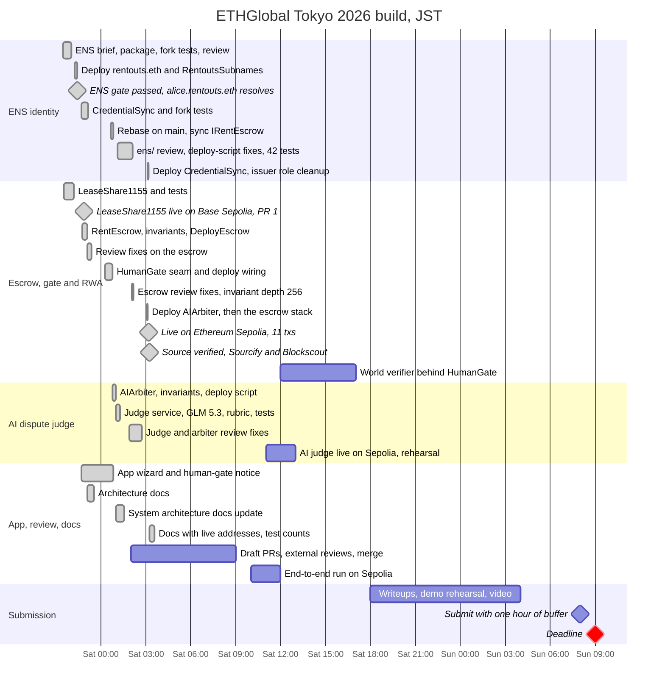
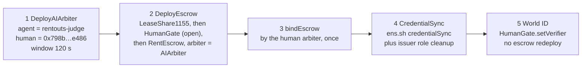
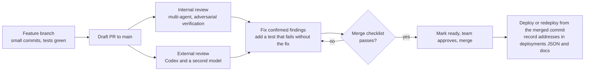

# Build plan

What we set out to build at ETHGlobal Tokyo 2026, what is in and out of scope, where each piece stands, the deploy order, how it maps to the sponsor tracks, and how code gets reviewed and merged. The system is described in [ARCHITECTURE.md](../ARCHITECTURE.md) and the reasoning in [DECISIONS.md](./DECISIONS.md).

**Deadline:** Sun 2026-09-27 09:00 JST. We aim to submit by 08:00.

---

## 1. What we set out to build

[RentOuts](https://rentouts.co) is an existing rental marketplace, so we entered the Continuity track. At the event we're building its on-chain layer, which has five parts that only make sense together:

1. **Money:** a non-custodial USDC escrow. The tenant prepays the deposit and rent into a contract. Rent unlocks to the landlord period by period, and the deposit comes back at the end. Neither RentOuts nor the landlord holds the funds.
2. **Disputes:** an AI judge that reads both parties' on-chain statements and proposes a split within seconds. Code computes the split from the model's answers, either party can appeal inside a challenge window, and a human arbiter has the last word. The arbiter contract can only split a disputed lease between its own two parties.
3. **Access:** a human gate on funding, so that World ID can require tenants to be unique humans. It plugs in without redeploying the escrow and never touches a funded lease.
4. **Identity and reputation:** a soulbound ENSv2 name (`alice.rentouts.eth`) that carries the tenant's track record. The record is derived on-chain from the escrow, and any app can read it through the ENS Universal Resolver.
5. **Asset:** each lease becomes an ERC-1155 real-world asset (`LeaseShare1155`) whose shares only move between compliance-allowlisted wallets.

The demo target: a judge watches one lease go from "landlord types an ENS name" to "tenant's ENS credential shows the finished lease", plus a dispute ruled by the AI judge and executed on-chain, in about 3 minutes on a public testnet ([DEMO.md](./DEMO.md)).

## 2. Scope

| In scope (this weekend) | Out of scope |
|---|---|
| `RentEscrow` with the lifecycle create → fund → claim → close, plus cancel and dispute → arbiter split | Mainnet, real funds, audits |
| Invariant suites INV-1..INV-4 and AI-1..AI-3, unit and fuzz tests, fork tests against live ENSv2 | Installments, streaming or late payments (prepay only) |
| `AIArbiter` and the AI judge service: on-chain evidence, typed questions to GLM 5.3, a split computed in code, an abstain rule, a challenge window with appeals, a human override | A calibrated AI, photo or document evidence, appeal bonds and dispute deadlines |
| `HumanGate` seam in `fundLease`, and a World ID verifier plugged in behind it on Saturday | A KYC provider (the share allowlist is set by the share owner) |
| `LeaseShare1155`, compliance-gated at listing and on every transfer | Paying rent or yield pro rata to share holders |
| ENSv2 subnames under `rentouts.eth`: soulbound, revocable, key-scoped issuer roles | A multisig or DAO as the human arbiter (a Safe later) |
| Permissionless `CredentialSync` (escrow → `rentouts.*` records) | Changes to the live rentouts.co product |
| A 5-step web app (Vite + React + wagmi/viem) on Ethereum Sepolia | Primary names (reverse records), MultiBaas (optional, Curvegrid) |
| Judge-facing docs: [ARCHITECTURE.md](../ARCHITECTURE.md), this folder, [`docs/ens/`](./ens/), READMEs | Internal research and runbooks, which stay in the private product repo |

## 3. Timeline (JST)

Done bars come from commit times and [`docs/ens/LOG.md`](./ens/LOG.md). The other bars are targets and move as the team re-plans.

### Done

| When (JST) | What | Evidence |
|---|---|---|
| Fri 21:27 | ENSv2 design brief and research, from a design session at the event | [`docs/ens/HANDOFF.md`](./ens/HANDOFF.md) |
| Fri 21:31 | `LeaseShare1155` with allowlist-gated transfers, plus tests | `feat/curvegrid-rwa` |
| Fri 21:35 | Live Sepolia checks: ENS v1 registration is off, so v2 is the only path | [LOG](./ens/LOG.md) |
| Fri 21:39–22:02 | `RentoutsSubnames`, a phased re-runnable deploy script, fork tests. A multi-agent review with adversarial verification found 17 issues, and the confirmed ones were fixed. | `ens-integration` |
| Fri 22:15–22:20 | `rentouts.eth`, our resolver and registry proxies, and `RentoutsSubnames` live: 21 txs, 0.0045 ETH in gas. `RentoutsSubnames` source verified. | [ARCHITECTURE §10](../ARCHITECTURE.md#10-deployments) |
| Fri 22:24 | **ENS go/no-go gate passed** (target was Sat 03:00): `alice.rentouts.eth` resolves `addr` and `rentouts.credential` through the Universal Resolver | claim tx [`0x882d63a5…`](https://sepolia.etherscan.io/tx/0x882d63a54d344760d5a10dd2455c25796ca3b930e7db50c96d9dea7b5f947500) |
| Fri 22:40 | Team decisions: one chain, Circle USDC, public repo stays judge-facing only | [DECISIONS](./DECISIONS.md) |
| Fri, by 22:51 | `LeaseShare1155` live on Base Sepolia with an on-chain compliance demo; PR #1 merged into `main`, then its architecture doc and diagrams (PR #2) | [`deployments.json`](../deployments.json) |
| Fri 22:51–22:58 | `RentEscrow`, invariant suite INV-1..INV-4, `DeployEscrow` (keystore signing) | `feat/core-escrow` |
| Fri 22:52 | `CredentialSync`, its fork tests and the `credentialSync` / `sync` deploy phases | `ens-integration` |
| Fri 23:05–23:16 | Review fixes: the issuer EOA gets no role on escrow-derived keys; the arbiter can never be a lease party; a dispute refund of unused rent no longer counts as a returned deposit; one `LeaseShare1155` per escrow | both branches |
| Fri 23:18 | 5-step app wizard | `feat/app` |
| Sat 00:15–00:44 | Human-gate seam: immutable `RentEscrow.humanGate`, a `HumanGate` with a swappable verifier, `DeployEscrow` deploys it open, 16 tests | `feat/core-escrow` |
| Sat 00:40–00:49 | `ens-integration` rebased on `main`, its `IRentEscrow` copy synced (30/30 fork tests). App review fixes and the human-gate notice on the fund step. | `ens-integration`, `feat/app` |
| Sat 00:45–01:14 | `AIArbiter` (31 tests, invariants AI-1..AI-3), `DeployAIArbiter`, and the judge service (GLM 5.3 and mock providers, rubric, abstain rules, `rulingHash`, 55 tests) | `feat/ai-judge` |
| Sat 01:00–01:32 | This documentation: one architecture doc for the whole system, merged with Dean's `LeaseShare1155` doc | `docs/system-architecture` |
| Sat 01:53–02:43 | Review fixes, judge: confidence counts only the answers the payout rests on; `--verify` also checks `inputHash`, and `--onchain` compares with the chain; hash-named ruling files that never overwrite an on-chain preimage; an injection screen in code; silence is not an admission; a mock proposal says so on-chain. `AIArbiter`: a two-step human handover (`setHuman`, then `acceptHuman`). Escrow: a dispute ruling counts earned rent as rent paid; the USDC-blacklist exit is tested; invariant depth is 256. Root 137 tests, judge 92. | `feat/ai-judge`, `feat/core-escrow` |
| Sat 01:05–02:05 | `ens/` review (no critical or high findings, no redeploy), then deploy-script fixes: `credentialSync` reconcile, sticky `removeIssuer`, parent checks. 42/42 fork tests. | `ens-integration`, [LOG](./ens/LOG.md) |
| Sat 03:05–03:09 | **Deployed on Ethereum Sepolia:** `AIArbiter`, then `LeaseShare1155`, `HumanGate` and `RentEscrow` (plus `setMinter`), then `bindEscrow`, then `CredentialSync` (plus `setIssuer`), then the issuer role cleanup (3 `revokeRoles`). 11 transactions, all status 1, about 0.0062 ETH. The wiring was read back on-chain (27/27 checks), and the 42 ENS fork tests passed against live Sepolia. | [ARCHITECTURE §10](../ARCHITECTURE.md#10-deployments) |
| Sat 03:15 | All five contracts source verified: Sourcify `exact_match` (creation and runtime code) and Blockscout. Each creation bytecode was rebuilt and matched byte for byte against its deploy transaction. Etherscan still needs an API key. | [ARCHITECTURE §10](../ARCHITECTURE.md#10-deployments) |
| Sat 03:25 | These docs updated with the live addresses and current test counts | `docs/system-architecture` |

### Next

| Target | What | Owner |
|---|---|---|
| Sat morning | **World integration:** a World ID verifier contract that implements `isVerified(address)`, then `HumanGate.setVerifier(worldVerifier)` on the live gate `0xFF68…3abd`, from the gate owner (the deployer). No escrow redeploy. | team |
| Sat morning | **Live demo on Sepolia:** point the app at the live addresses ([DEMO pre-flight](./DEMO.md#pre-flight-t-30-min)) and run the whole demo once. It covers lease → fund → claim → close → sync, then dispute → evidence → `./run.sh --lease <id> --propose` (GLM 5.3) → challenge window → `execute`. Rehearse an appeal and a `resolveByHuman` override. | team |
| Sat | Draft PRs, external reviews, fixes, merges (see §6) | team |
| Sat | Optional: Etherscan verification (needs an `ETHERSCAN_API_KEY`); Sourcify and Blockscout are done | team |
| Sat evening | ENS, Curvegrid and World writeups, ENS feedback file, optional MultiBaas | Bektur / Dean |
| Sat night | Demo rehearsal and video | team |
| Sun ≤ 08:00 | Submit | team |

## 4. Deploy order

Every link between the contracts is immutable except `HumanGate.verifier` and the `AIArbiter` settings, so the order is fixed. Steps 1 to 4 were broadcast on Sat 03:05–03:09 JST. The addresses, transactions and commands are in [ARCHITECTURE §10](../ARCHITECTURE.md#10-deployments). Step 5 is next.

1. **`AIArbiter`** first, because `RentEscrow.arbiter` is immutable. `AI_AGENT` is the address of the new `rentouts-judge` keystore; `AI_HUMAN` defaults to the human arbiter EOA `0x798b…e486`; the challenge window defaults to 120 s for the demo. Recorded under `"sepoliaAIArbiter"` in `deployments.json`.
2. **`DeployEscrow`** with `ESCROW_ARBITER` = the `AIArbiter` address. In one run it deploys `LeaseShare1155`, then `HumanGate` (owner = deployer, verifier `0` = open), then `RentEscrow`. It then makes the escrow the share minter and allowlists the deployer as the demo landlord. Recorded under `"sepolia"`.
3. **`bindEscrow(rentEscrow)`**, sent once by the human arbiter. `AIArbiter` refuses an escrow whose arbiter is not itself.
4. **`CredentialSync`** from `ens/` with `ESCROW_ADDRESS` = the escrow, which makes it a `RentoutsSubnames` issuer. Recorded in `ens/deployments/sepolia.json`. Also broadcast the issuer role cleanup.
5. **World ID** whenever its verifier is ready: `HumanGate.setVerifier(worldVerifier)` from the deployer.

Every script dry-runs first. The root scripts record addresses only in a real `--broadcast`, and the ENS phases send nothing unless `BROADCAST=true`.

## 5. Sponsor tracks

| Track | What we built for it | Where | Status |
|---|---|---|---|
| **ENS** | ENSv2 subnames in our own `UserRegistry`. Soulbound through ENS roles, revocable with a record wipe, never expiring. A shared `PermissionedResolver` with **key-scoped** issuer roles (Enhanced Access Control). Reads only through the Universal Resolver. An ENSIP-19 default address record. A credential derived on-chain from the escrow. | [`ens/`](../ens/), the app's identity step | 🟢 live on Sepolia, including `CredentialSync` and the issuer role cleanup |
| **Curvegrid: Best RWA Tokenization Project** | `LeaseShare1155`: ERC-1155 lease shares with compliance-aware transfer logic in `_update` (mint, single and batch). Minted to the allowlisted landlord at `createLease`, so listing is compliance-gated. | [`src/LeaseShare1155.sol`](../src/LeaseShare1155.sol) | 🟢 standalone on Base Sepolia; 🟢 integrated on Ethereum Sepolia (`0x9A9F…1E09`, minter = `RentEscrow`) |
| **World** | `HumanGate` in `fundLease`: a verified-human check on who may fund a new lease, with a verifier that can be set or swapped without redeploying the escrow. The World ID verifier plugs in behind it. | [`src/HumanGate.sol`](../src/HumanGate.sol), `RentEscrow.fundLease`, the app's fund step | 🟢 `HumanGate` live on Sepolia (open); 🟡 World verifier next |
| **Continuity** | RentOuts is a live product; everything in this repo was written during the event | [rentouts.co](https://rentouts.co) | n/a |

## 6. Review and merge process

**Branches** (Sat 01:30 JST):

| Branch | Contents | State |
|---|---|---|
| `main` | `LeaseShare1155` + Base Sepolia deploy (PR #1), its architecture doc and diagrams (PR #2) | merged |
| `feat/core-escrow` | `RentEscrow`, `IRentEscrow`, `HumanGate`, `IHumanGate`, unit/fuzz/invariant tests, `DeployEscrow` | contains `main`; PR next |
| `feat/ai-judge` | `AIArbiter`, `DeployAIArbiter`, `judge/`. Built on `feat/core-escrow`. | PR after core |
| `ens-integration` | `ens/` package, `docs/ens/` | rebased on `main`; PR next |
| `feat/app` | `app/`. Branched from an older `ens-integration` because it imports `ens/deployments/sepolia.json`. | needs `main` merged in |
| `docs/system-architecture` | root `ARCHITECTURE.md`, `docs/DECISIONS.md`, `PLAN.md`, `DEMO.md`. Renamed from a local `docs/architecture` so it can't clash with the already-merged remote branch of that name. | rebased on `main`; PR last |

**Merge order.** Each branch builds on the one before it:

1. `feat/core-escrow`: `RentEscrow` and `HumanGate` build on the `LeaseShare1155` already in `main`.
2. `feat/ai-judge`: `AIArbiter` is tested against the real `RentEscrow`.
3. `ens-integration`: `CredentialSync` depends on `IRentEscrow`, and `ens/src/interfaces/IRentEscrow.sol` must be identical to `src/interfaces/IRentEscrow.sol`.
4. `feat/app`: imports `ens/deployments/sepolia.json` and the escrow ABI.
5. `docs/system-architecture`: last, so it can fill in the deployed addresses.

**Merge checklist.**
- `forge test` is green in the root package and in `ens/` (fork tests). `npx tsc --noEmit && npx vitest run` is green in `judge/`. `npm test && npm run build` is green in `app/`.
- `diff src/interfaces/IRentEscrow.sol ens/src/interfaces/IRentEscrow.sol` is empty.
- No `.env`, keystore, API key or private key is tracked. Deploys and the judge sign with Foundry keystores (`--account`, `JUDGE_KEYSTORE`); the model API key (`ZAI_API_KEY`) comes from the environment only.
- New addresses are recorded in `deployments.json`, `ens/deployments/sepolia.json` and [ARCHITECTURE §10](../ARCHITECTURE.md#10-deployments).
- AI assistance is recorded (for example [`ens/AI_USAGE.md`](../ens/AI_USAGE.md)), per ETHGlobal rules.
- Only judge-facing material is in the public repo.

**House rules.** Commit every 45–60 minutes with real messages (ETHGlobal looks at git history). Nothing gets broadcast without a dry run first. ENS phases dry-run unless `BROADCAST=true`, and the root deploy scripts record addresses only on a real `--broadcast`.

**Review findings fixed so far**, each with a regression test:
- `revoke` left old records resolvable through the parent. It now wipes them with `linkToRecord(name, 0)`.
- The soulbound test was testing the wrong revert. It now checks `unsafeTransfer` → `TransferDisallowed`, with a positive control.
- The issuer EOA held roles on escrow-derived keys. The deploy now revokes them.
- An arbiter that was also the landlord could rule the whole escrow to itself. `createLease` now rejects it.
- A dispute refund of unused rent counted as a returned deposit. The attribution is fixed.
