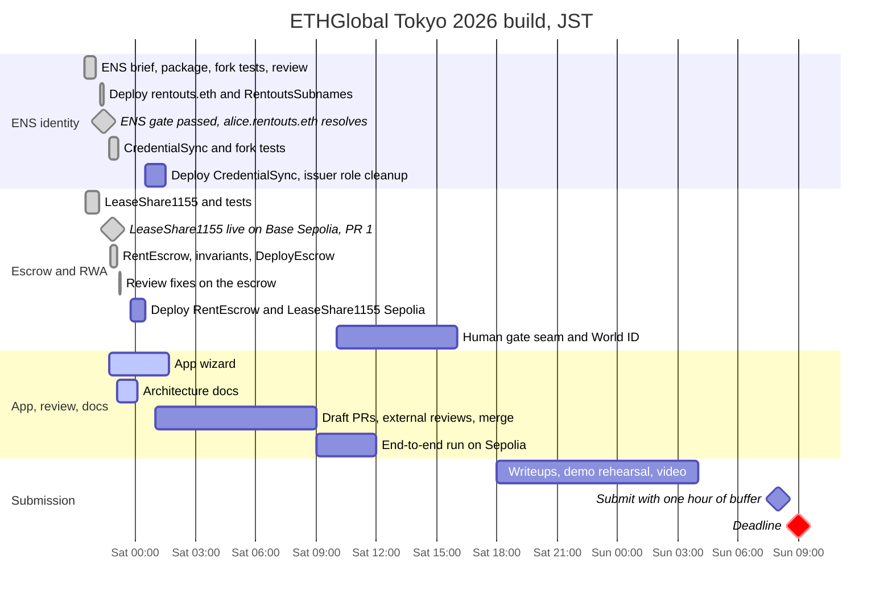
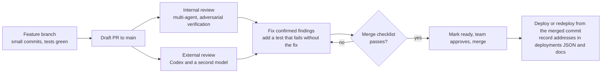

# Build plan

What we set out to build at ETHGlobal Tokyo 2026, what is in and out of scope, where each piece stands, how it maps to the sponsor tracks, and how code gets reviewed and merged. The system is described in [ARCHITECTURE.md](./ARCHITECTURE.md) and the reasoning in [DECISIONS.md](./DECISIONS.md).

**Deadline:** Sun 2026-09-27 09:00 JST. We aim to submit by 08:00.

---

## 1. What we set out to build

[RentOuts](https://rentouts.co) is an existing rental marketplace, so we entered the Continuity track. At the event we're building its on-chain layer, which has three parts that only make sense together:

1. **Money:** a non-custodial USDC escrow. The tenant prepays the deposit and rent into a contract. Rent unlocks to the landlord period by period, the deposit comes back at the end, and a fixed arbiter can only split a disputed lease between its two parties. Neither RentOuts nor the landlord holds the funds.
2. **Identity and reputation:** a soulbound ENSv2 name (`alice.rentouts.eth`) that carries the tenant's track record. The record is derived on-chain from the escrow, and any app can read it through the ENS Universal Resolver.
3. **Asset:** each lease becomes an ERC-1155 real-world asset (`LeaseShare1155`) whose shares only move between compliance-allowlisted wallets.

The demo target: a judge watches one lease go from "landlord types an ENS name" to "tenant's ENS credential shows the finished lease" in about 3 minutes, on a public testnet ([DEMO.md](./DEMO.md)).

## 2. Scope

| In scope (this weekend) | Out of scope |
|---|---|
| `RentEscrow` with the lifecycle create → fund → claim → close, plus cancel and dispute → arbiter split | Mainnet, real funds, audits |
| Invariant suite INV-1..INV-4, unit and fuzz tests, fork tests against live ENSv2 | Installments, streaming or late payments (prepay only) |
| `LeaseShare1155`, compliance-gated at listing and on every transfer | Paying rent or yield pro rata to share holders |
| ENSv2 subnames under `rentouts.eth`: soulbound, revocable, key-scoped issuer roles | A KYC provider (the allowlist is set by the share owner) |
| Permissionless `CredentialSync` (escrow → `rentouts.*` records) | Arbitration beyond a single testnet EOA (a Safe or a DAO later) |
| A 5-step web app (Vite + React + wagmi/viem) on Ethereum Sepolia | Changes to the live rentouts.co product |
| An optional human-gate seam in `fundLease` (World ID on Saturday) | Primary names (reverse records), MultiBaas (optional, Curvegrid) |
| Judge-facing docs: this folder, [`docs/ens/`](./ens/), READMEs | Internal research and runbooks, which stay in the private product repo |

## 3. Timeline (JST)

<!-- VERIFY: planned (not-done) bars are targets. Update them as the team re-plans; done bars come from commit times and docs/ens/LOG.md. -->

### Done

| When (Fri 09-25) | What | Evidence |
|---|---|---|
| 21:27 | ENSv2 design brief and research, from a design session at the event | [`docs/ens/HANDOFF.md`](./ens/HANDOFF.md) |
| 21:31 | `LeaseShare1155` with allowlist-gated transfers, plus tests | `feat/curvegrid-rwa` |
| 21:35 | Live Sepolia checks: ENS v1 registration is off, so v2 is the only path | [LOG](./ens/LOG.md) |
| 21:39–22:02 | `RentoutsSubnames`, a phased re-runnable deploy script, fork tests. A multi-agent review with adversarial verification found 17 issues, and the confirmed ones were fixed. | `ens-integration` |
| 22:15–22:20 | `rentouts.eth`, our resolver and registry proxies, and `RentoutsSubnames` live: 21 txs, 0.0045 ETH in gas. `RentoutsSubnames` source verified. | [ARCHITECTURE §8](./ARCHITECTURE.md#8-deployments) |
| 22:24 | **ENS go/no-go gate passed** (target was Sat 03:00): `alice.rentouts.eth` resolves `addr` and `rentouts.credential` through the Universal Resolver | claim tx [`0x882d63a5…`](https://sepolia.etherscan.io/tx/0x882d63a54d344760d5a10dd2455c25796ca3b930e7db50c96d9dea7b5f947500) |
| 22:40 | Team decisions: one chain, Circle USDC, World on hold, public repo stays judge-facing only | [DECISIONS](./DECISIONS.md) |
| by 22:51 | `LeaseShare1155` live on Base Sepolia with an on-chain compliance demo; PR #1 merged into `main` | [`deployments.json`](../deployments.json) |
| 22:51–22:58 | `RentEscrow`, invariant suite INV-1..INV-4, `DeployEscrow` (keystore signing) | `feat/core-escrow` |
| 22:52 | `CredentialSync`, its fork tests and the `credentialSync` / `sync` deploy phases | `ens-integration` |
| 23:05–23:14 | Review fixes: the issuer EOA gets no role on escrow-derived keys; the arbiter can never be a lease party; a dispute refund of unused rent no longer counts as a returned deposit; one `LeaseShare1155` per escrow | both branches |
| in progress | 5-step app wizard (`feat/app`) and these docs (`docs/architecture`) | |

### Next

| Target | What | Owner |
|---|---|---|
| Fri night | Deploy `RentEscrow` and the integrated `LeaseShare1155` on Sepolia, then record `deployments/sepolia.json` | escrow |
| Fri night | Deploy `CredentialSync` (`ESCROW_ADDRESS=… ./scripts/ens.sh credentialSync`). Broadcast the issuer role cleanup (`./scripts/ens.sh subnames`). | Bektur |
| Sat morning | Point the app at the deployed addresses and run the whole demo once on Sepolia | app |
| Sat | Draft PRs, external reviews, fixes, merges (see §5) | all |
| Sat | Human-gate seam in `fundLease`, then World ID behind it | escrow |
| Sat evening | ENS and Curvegrid writeups, ENS feedback file, optional MultiBaas | Bektur / Dean |
| Sat night | Demo rehearsal and video | all |
| Sun ≤ 08:00 | Submit | all |

<!-- VERIFY: owners and targets in the Next table. Only Dean (LeaseShare1155 / Curvegrid) and Bektur (ENS) are confirmed track owners. -->

## 4. Sponsor tracks

| Track | What we built for it | Where | Status |
|---|---|---|---|
| **ENS** | ENSv2 subnames in our own `UserRegistry`. Soulbound through ENS roles, revocable with a record wipe, never expiring. A shared `PermissionedResolver` with **key-scoped** issuer roles (Enhanced Access Control). Reads only through the Universal Resolver. An ENSIP-19 default address record. A credential derived on-chain from the escrow. | [`ens/`](../ens/), the app's identity step | 🟢 live on Sepolia (`CredentialSync` pending) |
| **Curvegrid: RWA tokenization** | `LeaseShare1155`: ERC-1155 lease shares with compliance-aware transfer logic in `_update` (mint, single and batch). Minted to the allowlisted landlord at `createLease`, so listing is compliance-gated. | [`src/LeaseShare1155.sol`](../src/LeaseShare1155.sol) | 🟢 standalone on Base Sepolia; 🟡 integrated deploy on Sepolia pending |
| **World** | An optional human gate in `fundLease` (`isVerified(tenant)`, 0 = off). World ID plugs in behind it. | `RentEscrow` | ⏸ deferred to Saturday; seam in progress |
| **Continuity** | RentOuts is a live product; everything in this repo was written during the event | [rentouts.co](https://rentouts.co) | n/a |

<!-- VERIFY: exact sponsor prize names as listed on the ETHGlobal Tokyo 2026 prizes page. -->

## 5. Review and merge process

**Merge order.** Each branch builds on the one before it:

1. `feat/core-escrow`: `RentEscrow` builds on the `LeaseShare1155` already merged in PR #1.
2. `ens-integration`: `CredentialSync` depends on `IRentEscrow`, and `ens/src/interfaces/IRentEscrow.sol` must be identical to `src/interfaces/IRentEscrow.sol`.
3. `feat/app`: imports `ens/deployments/sepolia.json` and the escrow ABI.
4. `docs/architecture`: last, so it can fill in the deployed addresses and clear the `VERIFY` notes.

**Merge checklist.**
- `forge test` is green in the root package and in `ens/` (fork tests), and `npm test && npm run build` is green in `app/`.
- `diff src/interfaces/IRentEscrow.sol ens/src/interfaces/IRentEscrow.sol` is empty.
- No `.env`, keystore or private key is tracked. Deploys sign with Foundry keystores (`--account`).
- New addresses are recorded in `deployments/sepolia.json`, `ens/deployments/sepolia.json` and [ARCHITECTURE §8](./ARCHITECTURE.md#8-deployments).
- AI assistance is recorded (for example [`ens/AI_USAGE.md`](../ens/AI_USAGE.md)), per ETHGlobal rules.
- Only judge-facing material is in the public repo.

**House rules.** Commit every 45–60 minutes with real messages (ETHGlobal looks at git history). Nothing gets broadcast without a dry run first. ENS phases dry-run unless `BROADCAST=true`, and `DeployEscrow` records addresses only on a real `--broadcast`.

**Review findings fixed so far**, each with a regression test:
- `revoke` left old records resolvable through the parent. It now wipes them with `linkToRecord(name, 0)`.
- The soulbound test was testing the wrong revert. It now checks `unsafeTransfer` → `TransferDisallowed`, with a positive control.
- The issuer EOA held roles on escrow-derived keys. The deploy now revokes them.
- An arbiter that was also the landlord could rule the whole escrow to itself. `createLease` now rejects it.
- A dispute refund of unused rent counted as a returned deposit. The attribution is fixed.
